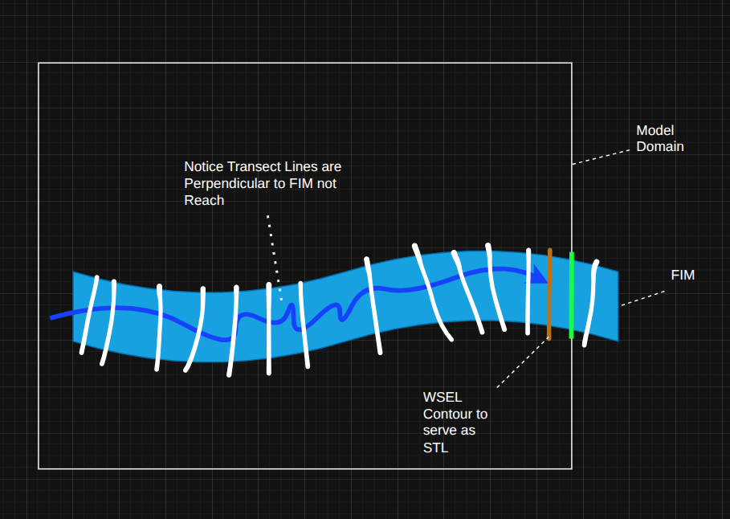

# Methodology Report: Automated 2D Reach-Based FIM Libraries (Pilot Phase)

## Executive Summary
This report presents a pilot‑informed methodology for producing nationwide 2D flood inundation map (FIM) libraries using reach‑based hydrodynamic modeling. The approach preserves the core operational pattern of Ripple1D—pre‑generated per‑reach libraries assembled downstream‑to‑upstream with flows2fim—while replacing 1D/GIS‑based assumptions with 2D physics where feasible. Our work to date has focused on developing a “loose” methodology that can be automated, identifying decisions that materially affect outcomes, and recording evidence for those decisions through an SDR process.

Key outcomes to date indicate that a reach‑based 2D library approach is feasible and integrates directly with existing flows2fim mosaicking workflows. Stage transfer (downstream WSEL) is required at confluences and other backwater‑sensitive settings because normal‑depth‑only boundaries underpredict WSEL. Domain and stage‑transfer geometry must extend beyond hydrofabric divides in wide floodplains, and coarse modeling helps place transfer lines in large rivers. DEM conditioning around culverts and structures is critical to avoid divergent flow paths and impoundment artifacts. Lake and coastal reaches require non‑standard handling, where GIS‑based or waterbody‑stage approaches are more appropriate.

This report documents the conceptual framework, the evidence‑driven methodology evolution, a proposed automation workflow, known limitations, and a unified appendix of pilot and SDR cases. Once approved, the methodology will be refined and implemented in a prototype area before scaling.

## Introduction
OWP currently produces national flood inundation maps using HAND‑based GIS methods and, where available, Ripple1D libraries. These approaches provide broad coverage and operational reliability, but they have known limits in physical accuracy, reproducibility, and the ability to adapt across diverse hydraulic settings. Recent advances in GPU/HPC compute, cloud parallelization, and modern 2D hydrodynamic solvers make it plausible to scale 2D modeling beyond bespoke studies and into a national library‑based system.

HAND‑style approaches are computationally efficient, but they do not capture backwater effects, structure‑influenced hydraulics, or the cross‑sectional detail embedded in engineered models. This gap motivates the shift to hydrodynamic modeling while retaining an operational workflow that can deliver maps quickly.

This work builds directly on the Ripple1D concept: pre‑generate per‑reach FIM libraries and mosaic them downstream‑to‑upstream using flows2fim and forecast discharges. The difference is the engine—2D hydrodynamics rather than 1D or GIS approximations—and the resulting need for additional automation around domains, boundary conditions, stage transfer lines, and special cases. The report lays out a pilot‑informed methodology that is intentionally loose: it captures what we know works, flags what is unresolved, and documents evidence for key decisions. Once approved, this methodology will be refined and implemented in a prototype area before scaling further.

By shifting heavy computation to pre‑processing, the library approach enables near real‑time map generation during operations. Forecast‑time assembly is reduced to selection and mosaicking rather than new hydraulic simulation, which is critical for latency and scalability.

At continental scale, this library‑based approach reflects a necessary operational tradeoff: pre‑compute hydraulics offline, then **look up and composite** reach‑level products during forecasting rather than running new simulations on‑demand. This paradigm preserves backwater physics while keeping forecast‑time latency tractable, and it is the operational foundation we are extending to 2D hydrodynamics.

*Figure TBD. Reach-based hydrodynamic modeling for the National Water Model using 1D and 2D approaches.*

### Related Work and Context
This project sits at the intersection of three mature research threads: **library‑based inundation mapping**, **large‑scale 2D hydrodynamics**, and **automated model setup**. The literature below provides the closest precedents and highlights where our approach diverges.

**Library‑based inundation mapping (operational precedents).** The USGS Flood Inundation Mapping (FIM) program defines a **map library** as a set of inundation maps at discrete stages, linked to gages and used operationally for preparedness and response. The USGS process emphasizes repeatable model construction, calibration, and library publication for real‑time use, which is conceptually aligned with our library‑first paradigm (even though it is local and not reach‑based at national scale). This is a strong institutional precedent for the idea that *precomputed libraries + real‑time lookup* can be operationally reliable (USGS FIM Program; USGS FIM Science).  

**Continental‑scale 2D forecasting with precomputed libraries (closest analogue).** The Hurricane Harvey study by Wing et al. (2019, *Journal of Hydrology X*) is the closest direct analogue. The authors coupled **Fathom‑US** (a continental‑scale 2D model based on LISFLOOD‑FP) to NOAA forecasts of streamflow, rainfall, and coastal surge. For Harvey, **fluvial inundation was extracted from an existing US‑wide simulation library**, while pluvial and coastal components were simulated for the event. The study produced medium‑term (2–15 day) forecasts and hindcasts, with reported skill around CSI ≈ 0.66 for maximum extent and mean water‑surface error on the order of ~1 m against USGS benchmarks. This work demonstrates that a national 2D library can be operationally coupled to forecasts without crippling lead times. Our approach differs by (1) making the library **reach‑based**, (2) emphasizing **downstream stage transfer** between connected reaches, and (3) treating library construction as a per‑reach automation problem rather than a single continental model run.

**Global and regional return‑period libraries (library at scale, but not reach‑based).** The Copernicus CEMS/GloFAS global river flood hazard maps provide **precomputed inundation depth layers** for multiple return periods (10–500 years). They are derived from LISFLOOD river flows and LISFLOOD‑FP inundation simulations, and are intended for exposure assessment and impact‑based forecasting. These maps are explicitly designed as **global library products** and are used operationally for rapid mapping. However, they are **return‑period‑binned** and network‑linked rather than reach‑specific with downstream stage transfer. This demonstrates feasibility of large‑scale library generation and operational linkage to hydrologic forecasts, while also highlighting the gap our reach‑based approach addresses.

**Automated 2D model setup frameworks.** HydroMT provides a reproducible, data‑driven framework for building hydrologic and hydrodynamic models at scale. Its ecosystem (including HydroMT‑SFINCS) has been used to automate **globally applicable compound‑flood modeling** from global datasets, with boundary conditions coupled to upstream hydrology and coastal surge/tide models. The NHESS compound‑flood framework demonstrates automated, large‑scale 2D setup and transparent, repeatable preprocessing at global scales. These efforts are the closest open‑source automation precedents, though they target event‑based simulations rather than reach‑based library construction with stage transfer between connected reaches.

**Reach‑integrated hybrid approaches (large‑scale speed).** Recent work in GMD proposes **reach‑integrated** methods that blend geomorphic information (HAND) with simplified hydraulics (a steady‑state 1D model), enabling real‑time inundation mapping at very low computational cost. Reported speedups can be orders of magnitude (e.g., ~10,000× faster in one case study), and the framework is designed to accommodate hydraulic structures and energy losses beyond pure HAND. These methods offer a complementary approach where full 2D physics may be impractical, but they do not provide the same level of hydrodynamic detail or boundary‑condition fidelity as a 2D library with explicit downstream stage transfer.

**Foundational 2D floodplain modeling lineage.** The raster‑based formulation in Bates & De Roo (2000, *Journal of Hydrology*) introduced a simplified yet dynamic representation using a 1D kinematic wave for channel flow coupled to a 2D diffusion‑wave floodplain. This formulation underpins many modern large‑scale flood models, including LISFLOOD‑FP. The paper provides the methodological lineage for efficient raster‑based modeling at scale and is the technical foundation behind many of the large‑domain models discussed above.

**Selected references (with links).**
1. USGS Flood Inundation Mapping (FIM) Program: https://www.usgs.gov/mission-areas/water-resources/science/flood-inundation-mapping-fim-program  
2. USGS FIM Science (map library definition): https://www.usgs.gov/mission-areas/water-resources/science/flood-inundation-mapping-science  
3. Wing, O. E. J. et al. (2019). *A flood inundation forecast of Hurricane Harvey using a continental‑scale 2D hydrodynamic model.* Journal of Hydrology X, 4, 100039. https://doi.org/10.1016/j.hydroa.2019.100039  
4. JRC CEMS/GloFAS Global River Flood Hazard Maps (v2.1): https://developers.google.com/earth-engine/datasets/catalog/JRC_CEMS_GLOFAS_FloodHazard_v2_1  
5. Eilander, D. et al. (2023). *HydroMT: Automated and reproducible model building and analysis.* JOSS, 8(83), 4897. https://doi.org/10.21105/joss.04897  
6. Eilander, D. et al. (2023). *A globally applicable framework for compound flood hazard modeling.* NHESS, 23, 823–. https://nhess.copernicus.org/articles/23/823/2023/  
7. Chlumsky, R. et al. (2025). *A reach‑integrated hydraulic modelling approach for large‑scale and real‑time inundation mapping.* GMD, 18, 3387–3403. https://doi.org/10.5194/gmd-18-3387-2025  
8. Bates, P. D. & De Roo, A. P. J. (2000). *A simple raster‑based model for flood inundation simulation.* Journal of Hydrology, 236, 54–77. https://doi.org/10.1016/S0022-1694(00)00278-X  

Taken together, prior work demonstrates the feasibility of **precomputed libraries**, **large‑scale 2D simulation**, and **automated model setup**, but the specific synthesis of **reach‑based 2D modeling with downstream stage transfer and flows2fim‑compatible libraries** is not yet well represented in the literature and is the central contribution of this methodology.

## Conceptual Modeling Framework
The conceptual framework mirrors the Ripple1D library approach, but uses 2D hydrodynamic models per reach. At a high level, the workflow is:

1. Build an individual 2D model for each reach using the NWM hydrofabric.
2. Apply boundary conditions for each model run using a discharge range at the upstream boundary and a downstream stage derived from the downstream reach simulation.
3. Simulate combinations of discharge and downstream stage to build a per-reach FIM library.
4. Mosaic per-reach FIMs downstream-to-upstream using flows2fim to match both at-reach discharge and downstream stage within a defined tolerance.

Each reach model consists of a rectangular domain, an inflow boundary, a stage transfer line (STL), and an outflow boundary. The downstream reach acts as the donor and the upstream reach as the receiver; a water-surface tie-in is enforced at the receiver STL to propagate backwater effects. In the “simple case,” this structure covers most reaches. Special cases such as lake/coastal reaches, large floodplains, or hydraulically coupled reaches require modifications described later in this report.

*Figure TBD. Example geometry for a single reach-based model showing inflow, outflow, and stage transfer lines.*

Operationally, this library framework relies on a simple three‑input architecture that mirrors flows2fim: (1) **pre‑computed FIM libraries** indexed by reach, discharge, and downstream stage; (2) a **rating‑curve database** that maps discharge to downstream water‑surface elevations; and (3) a **controls table** that specifies which flow and boundary condition to use per reach in a given forecast cycle. This separation keeps heavy computation offline and makes operational assembly lightweight.

*Figure TBD. Overview of discretizing a river system into reach-based 2D hydrodynamic models.*

*Figure TBD. Example composite FIM for a low‑magnitude flood along all reaches.*

*Figure TBD. Example composite FIM for a high‑magnitude event along the mainstem and a low‑magnitude event along a tributary.*

## Methodology Development
We began with the expectation that automated creation of 2D models with information transfer between connected reaches would require many interdependent decisions. Our initial methodology was intentionally loose, focused on producing workable models quickly so we could observe failures and iterate. As pilot work progressed, we encountered cyclic decision-making where one choice would improve one case but worsen another. To break that cycle, we implemented SDR and documented each decision with evidence, enabling us to converge on a defensible methodology while retaining alternatives for future refinement.

The sections below describe the current methodology inputs and tools, followed by a narrative of how key decisions evolved.

### Input Data
Topography is sourced from USGS 3DEP and resampled to 10 m resolution. Surface roughness is sourced from MRLC NLCD and converted to Manning’s n using a USACE-derived lookup table. Reach geometry and connectivity are based on the NWM hydrofabric. Pilot discharge inputs are derived from USGS gages and StreamStats; production runs will use NWM discharges.

[Placeholder: table listing datasets, versions, and processing steps.]

### 2D Model Selection
Model selection is pending. We conducted a scoping survey to evaluate candidate 2D models against factors that matter for national‑scale automation: equations solved, grid/mesh approach, automation readiness, CPU/GPU performance, Linux and container support, checkpointing/hot‑start, boundary condition flexibility, output availability, maturity, documentation, and licensing.

This methodology is intentionally model‑agnostic at this stage. LISFLOOD‑FP, TRITON, and SFINCS remain active candidates, and the selection will be made after focused performance and cost testing on our target hardware. The current work should be treated as a pilot; before large‑scale production, a separate effort is needed to benchmark speed, stability, and cost for all three models in a prototype HUC6‑scale area.

#### Shortlist (continuing examination)
**LISFLOOD‑FP** is attractive for national automation because it is fast, GPU‑accelerated for select solvers (ACC, FV1, DG2), well documented, and widely used in the literature. It supports checkpointing and exports WSE and velocity grids, which align with our library workflow. A key consideration is that some solvers rely on Manning‑based formulations rather than full shallow‑water equations, and GPU support is solver‑specific.  

**TRITON** solves the full shallow‑water equations (ARoe solver) and shows strong GPU performance when available. It supports checkpointing and exports depth and velocity fields. The tradeoff is maturity: CPU‑only performance is weaker, and the toolchain and documentation are still evolving.  

[Wasn't there a big reason for TRITON not being there]

#### Secondary candidates 
**SFINCS** solves the shallow‑water equations with a simplified formulation (convective acceleration ignored) and has a strong automation pathway via HydroMT, which is attractive for reproducibility and rapid setup. It remains a secondary candidate pending validation for reach‑based riverine use cases.  

[HydroMT work form Scott]

#### Removed from consideration for this phase
**HEC‑RAS 2D** is removed due to automation risks tied to GUI‑centric workflows, mesh stability, sub‑grid artifacts, and complex data handling. RAS 2025 remains too uncertain in timeline and stability for this project phase. FastFlood is not a hydrodynamic model and does not meet the physical requirements. The PNNL Lagrangian model is research‑grade and not production ready. Commercial models (MIKE21, FLO‑2D, Delft3D, TUFLOW 3D) are excluded due to licensing and deployment constraints incompatible with national automation.

Final model selection will be based on pilot benchmarks for speed, stability, automation effort, output fidelity, and cost.

**Table: 2D model survey summary (decision basis)**  

| Model                                 | Equations / Approach                                                                      | Grid / Automation                                       | Performance                                          | Linux / Container                                        | Boundary Conditions & IO                                                                                                                 | Status / Rationale                                                              |
| ------------------------------------- | ----------------------------------------------------------------------------------------- | ------------------------------------------------------- | ---------------------------------------------------- | -------------------------------------------------------- | ---------------------------------------------------------------------------------------------------------------------------------------- | ------------------------------------------------------------------------------- |
| LISFLOOD‑FP                           | Multiple solvers; some solve shallow‑water equations; some use Manning‑based formulations | Gridded; automation feasible; broad community patterns  | Fast; GPU support for ACC, FV1, DG2                  | Linux‑friendly; containerizable                          | Supports hydrograph, fixed inflow, free‑flow (valley slope), constant or time‑varying WSE; exports WSE and velocity grids; checkpointing | Continue evaluation; strong literature and tooling, good performance            |
| TRITON                                | Full shallow‑water equations (ARoe solver)                                                | Gridded; automation feasible; maturity still developing | Very fast on GPU; weaker on CPU                      | Linux‑friendly; containerizable                          | Supports hydrograph, free flow, constant WSE, normal slope, Froude number; exports depth/velocity; checkpointing                         | Continue evaluation; strong physics and GPU speed, less mature                  |
| SFINCS                                | Shallow‑water equations with simplified formulation (convective acceleration ignored)     | Gridded; HydroMT provides automated setup               | Fast for large domains; performance depends on setup | Linux‑friendly; containerizable                          | Boundary conditions supported via HydroMT workflows; standard raster outputs                                                             | Secondary candidate; strong automation, needs validation for reach‑based rivers |
| TELEMAC‑2D                            | Shallow‑water equations                                                                   | Mesh‑based; may require code‑level adjustments          | Reported fast; widely used in EU                     | Linux‑capable; containerization possible but non‑trivial | Standard hydraulic BCs; IO requires integration work                                                                                     | Not prioritized; higher automation burden                                       |
| HEC‑RAS 2D                            | Shallow‑water equations with sub‑grid approach                                            | Mesh‑based; GUI‑centric                                 | Good for engineering studies; automation burden high | Windows‑centric; Linux uncertain                         | Rich BCs, but IO complex                                                                                                                 | Removed; automation and data handling risks                                     |
| RAS 2025 (alpha)                      | Shallow‑water equations                                                                   | Mesh‑based; API not released                            | Unknown stability                                    | Linux/API uncertain                                      | Unknown                                                                                                                                  | Removed; timeline risk                                                          |
| FastFlood                             | GIS‑hydraulic hybrid                                                                      | Gridded                                                 | Very fast (per literature)                           | Unknown                                                  | Outputs not aligned with hydrodynamic needs                                                                                              | Removed; not a 2D hydrodynamic model                                            |
| PNNL Lagrangian                       | Novel research method                                                                     | Unclear                                                 | Supposedly fast                                      | Unclear                                                  | Unclear                                                                                                                                  | Removed; research‑grade                                                         |
| MIKE21 / FLO‑2D / Delft3D / TUFLOW 3D | Hydrodynamic models                                                                       | Mixed                                                   | Strong but commercial                                | Licensing constraints                                    | Proprietary tooling                                                                                                                      | Removed; licensing incompatible                                                 |

[Placeholder: final model selection once pilot benchmarks are complete.]

**HEC‑RAS 2D: Rationale for Removal**
HEC‑RAS remains an industry‑standard tool with a mature user base, but several characteristics make it a poor fit for national‑scale, automated, cloud‑native production. First, model development and mapping workflows are tightly coupled to a Windows‑based GUI. This introduces a hard dependency on Windows in an otherwise Linux‑native, containerized pipeline. Attempts to run HEC‑RAS under emulation (e.g., Wine) have been unreliable and are not suitable for production automation.  

Second, mesh generation and refinement are not readily automatable outside the GUI. Mesh sensitivity is a common source of instability in HEC‑RAS models and typically requires manual troubleshooting. At national scale, this creates a high operational burden and increases the risk of inconsistent outputs.  

Third, HEC‑RAS uses a sub‑grid formulation that complicates volume accounting and can introduce known artifacts in derived flood rasters (e.g., cupping, disconnected hydraulic reaches). These issues would require additional post‑processing and quality control steps, which adds complexity to an automated pipeline.  

Finally, HEC‑RAS data management is complex: the software uses a mix of text, binary, HDF, and DSS formats, often with duplicated data across files. This makes automation, storage, and reproducibility more difficult at scale.  

USACE announced an alpha “RAS 2025” release promising a Linux build and API for headless operation, but those capabilities are not yet available or stable enough to de‑risk this project timeline. Even if released, the mesh, sub‑grid, and data‑format concerns would remain. For these reasons, HEC‑RAS was removed from consideration for this phase.

### Tooling
Pilot work used a lightweight automated tool to generate model domains, boundary condition geometries, and raster inputs. This tool accelerated iteration, made model construction repeatable, and exposed design requirements for a production pipeline. A production-ready toolchain will be developed after methodology approval and prototype validation.

“From an automation standpoint, 2D modeling avoids a major 1D bottleneck: the placement and refinement of cross‑sections at hydraulically significant locations. HEC‑RAS guidance makes clear that cross‑sections must be positioned near structures, slope changes, and junctions—decisions that remain judgment‑intensive even when terrain‑extraction tools are used. In contrast, 2D setup replaces cross‑section placement with repeatable grid and domain rules, which are more amenable to automation. That said, the automation burden does not disappear; it shifts to grid resolution, domain extent, boundary condition placement, and DEM conditioning.” (hec.usace.army.mil)

For 2D, there is published evidence of automated model setup at scale (e.g., HydroMT‑SFINCS global setup in NHESS), which supports the idea that 2D automation can be more straightforward in geometry definition—but it shifts effort to grid definition, domain trimming, boundary conditions, and data conditioning. (nhess.copernicus.org)

*Figure TBD. Pilot tooling used to automate model construction and review.*

... To be expanded
### System Decision Records (SDR)
SDR is used to preserve decision evolution and evidence. Each decision is framed as a narrow, testable question with explicit alternatives. Cases and experiments provide evidence to accept, reject, or revise alternatives. This enables us to avoid repeating rejected ideas without new evidence while still keeping alternatives visible for future reconsideration.

### Glossary
Key terms are defined in the SDR glossary and are summarized here for report consistency. These include terminal reaches, lake/coastal reaches, headwater reaches, reach start and outlet, common outlet reaches, connected reaches, and adjacent reaches.

Link to appendix.
### Pilot Cases
We selected pilot locations to cover a wide range of physiographic and hydraulic conditions we expected to stress the method: small rural rivers, steep headwaters, urban corridors with structures, large rivers with very wide floodplains, desert washes, lake/terminal reaches, and coastal settings. These pilots were complemented by targeted SDR cases chosen specifically because we expected to encounter known issues (e.g., backwater at confluences, culvert obstructions, inflow artifacts, and domain truncation). The appendix summarizes each case in a consistent format and provides the basis for the decisions described below.

*Figure TBD. Locations of pilot study sites.*

... to be expanded
### Key Decisions for Automation
We began with a simple, pragmatic approach: model each reach in isolation, apply basic boundary conditions, and rely on downstream-to-upstream sequencing to propagate backwater. As soon as we tested this in pilot sites, we encountered systematic issues. The narrative below describes the most important decisions and how evidence led to our current choices. These decisions are presented as isolated questions, but together they form the methodology described in later sections.

**Do we need downstream stage transfer (KWSE), or can we rely on normal depth?**
Our early tests compared runs that used only normal-depth boundaries at the downstream end against runs that used stage transfer from the downstream model. In a confluence with stream-order mismatch, the normal-depth runs produced lower water surface elevations near the downstream tie-in and underrepresented backwater. Stage transfer produced a closer tie-in and more realistic flood extents upstream. Based on this, we currently apply downstream stage transfer for all reaches, including confluences and mainstem-tributary interactions.

This approach aligns with the flows2fim operational algorithm, which traverses the NWM network downstream‑to‑upstream and propagates downstream WSELs as boundary conditions. Preserving this sequential propagation is essential for backwater‑sensitive settings and is a core requirement for interoperability with the library‑based workflow.

Operationally, this implies a two‑pass strategy similar to Ripple1D: normal‑depth runs can be used to establish rating curves and baseline conditions, followed by KWSE‑informed runs to produce the depth grids used in the library. That separation keeps the lookup logic consistent while ensuring downstream boundary conditions are explicitly represented in the final maps.

*Figure TBD. KWSE vs normal-depth comparison showing lower WSEL near tie-in without downstream stage transfer.*

**Where should edge boundary conditions allow flow to leave the domain?**
We initially applied normal depth along all model edges. This caused water to leave the domain at non-outlet locations, especially where upstream tributaries intersected the domain boundary. This broke mass balance and produced unnatural inundation. We now apply normal-depth boundaries only to edge cells that intersect downstream flood extents, and we use the reach centerline slope for those cells. This change reduced non-physical outflows while still allowing discharge to exit the domain.

*Figure TBD. Water leaving the domain at non‑outlet locations when normal depth is applied at all edges.*

**How should lake and coastal reaches be handled?**
For terminal reaches discharging to lakes or the coast, we tested low-slope normal-depth boundaries and found that they caused pooling at the downstream end. Using downstream stage transfer plus reach slope avoided this pooling and provided a more stable tie-in. We now treat lake/coastal reaches with waterbody-informed edge handling and define their stage transfer line where the model domain intersects the waterbody polygon. Criteria for classifying lake/coastal reaches remain an open item.

*Figure TBD. Lake reach behavior under normal‑depth boundary conditions.*

*Figure TBD. Lake reach behavior under downstream stage transfer.*

**Where should the stage transfer line (STL) be placed?**
We compared applying stage transfer at the model boundary versus using a line inside the domain. Boundary-based transfer can cause abrupt width changes when downstream flow is much larger, while a line-based transfer improves continuity. We currently use an STL derived from the first downstream WSEL contour and keep one STL per reach (derived from a coarse model) for all runs. Flat reaches and inflow-adjacent anomalies remain areas for refinement.

*Figure TBD. Alternative STL placement geometry to reduce WSEL anomalies.*

**How should the model domain be defined and expanded?**
We initially used reach divides to define model domains. Pilot tests showed that reach divides can be too narrow, truncating flood extents and cutting off inundation at domain edges. We now build domains from coarse-model extents or buffered reach geometry and apply elevation-informed expansion until edge flooding is limited to elevations below the reach outlet. This reduces truncation while keeping domains efficient.

*Figure TBD. Flood extent truncated at domain edge when using reach-divide domains.*

*Figure TBD. Comparison to benchmark FIM showing edge truncation.*

**What inflow geometry should be used?**
Point inflows at the reach start caused “bullseye” artifacts in water-surface elevation contours. Inflow lines reduced these artifacts and produced smoother WSEL surfaces. We now use a perpendicular inflow line on the upstream mainstem, 100 m wide and offset 0.25 of the upstream reach length. For headwater reaches, a point inflow remains under review because it conflicts with observed artifacts in pilot tests.

*Figure TBD. Point inflow producing WSEL “bullseye” artifacts.*

*Figure TBD. Line inflow reduces WSEL artifacts.*

**How should DEM conditioning handle culverts and obstructions?**
Unmodified DEMs resulted in divergent flowpaths and impounded flow where culverts or small structures were not represented. These artifacts were visible in pilot comparisons and can underpredict downstream flooding. We have rejected a “no conditioning” approach and are evaluating alternatives such as AGREEDEM channel burning, burning streams at roads, breaching flow obstructions, and custom conditioning workflows.

*Figure TBD. Divergent flowpath caused by unburned culverts.*

*Figure TBD. Flow impounded upstream of a culvert/road crossing.*
**How should composite maps be built?**
Overlapping reach maps require a consistent compositing strategy. We currently use a pixelwise maximum approach. This choice is robust to overlap, but it can amplify localized artifacts, which reinforces the need to minimize boundary-condition anomalies and inflow artifacts.

**How do we handle short or flat reaches?**
Short reaches can be inefficient and can distort results when modeled in isolation. We currently merge higher stream-order continuous reaches with negligible drainage-area differences. Flat reaches remain a challenge because they can cause level-pool behavior and unstable stage contours; slope criteria and additional merging rules are under development.

Experience from Ripple1D conflation also highlights “eclipsed” reach situations where a very short reach falls entirely between cross‑sections (or, in our context, between effective model control points). These cases reinforce the need for reach‑merging and eclipsing rules in the 2D pipeline, especially near confluences and in complex junctions where strict reach‑by‑reach modeling can introduce artificial boundaries.

**How do we determine quasi-steady state?**
The methodology assumes steady-flow conditions for each run. We are evaluating criteria based on mass balance (Qin ≈ Qout) and WSEL stabilization between time steps. This is an open decision that will be finalized during prototype automation.

Together, these decisions define the current methodology and inform the proposed automation workflow described below.

## Proposed Automation Workflow
This workflow is under development and will be refined as decisions are finalized. It is designed to translate the methodology into a repeatable national-scale pipeline.

*Figure TBD. Proposed production framework for automated 2D FIM libraries.*

### Coarse Modeling
Coarse simulations are used to estimate maximum flood extents and to derive a hydraulic reach network that reflects actual inundation sources. Coarse outputs also seed initial stage surfaces for lake/coastal reaches and help identify areas where the simple reach-based framework is likely to fail.

*Figure TBD. Coarse modeling workflow used to inform reach network and STL placement.*

### Initial Model Creation
For each reach, the pipeline generates inflow geometry, a model domain, a stage transfer line, and initial raster inputs. DEM and roughness rasters are prepared at 10 m resolution, and conditioning rules are applied where culverts or obstructions are likely. Domain expansion rules ensure that flood extents are not truncated at model edges.

*Figure TBD. Initial model creation workflow.*

### Simulation Execution
Simulation files are generated automatically for each discharge and downstream stage combination. Runs proceed downstream-to-upstream to propagate stage transfer. Quasi-steady state is evaluated using a consistent criterion. Outputs are converted into FIM rasters and stored as per-reach libraries for later mosaicking.

### Data Model
From an operational standpoint, the library structure should remain consistent with flows2fim conventions: a directory per reach, subdirectories per downstream stage (WSE) level, and discharge‑indexed rasters (plus a domain mask). Maintaining this structure ensures libraries remain composable in near real time and simplifies cloud storage and retrieval.

[talk about data model]

*Figure TBD. Simulation execution workflow.*

## Step-by-Step Example
[Placeholder: worked example with embedded QGIS maps and model inputs/outputs.]

### Comparison with 2D Map for the Area
[Placeholder: side-by-side comparison and discussion of differences.]

## Limitations and Challenges
Even with the current decisions, several issues remain recurring or require special handling. These limitations inform both the current methodology and the open decisions to be resolved during the prototype phase.

### Lack of Bathymetric Data
Effects of bathymetric data absence/presence on 2D model results.

Here, we looked at the Ohio River near Evansville, IN. Bathymetric data came from USACE eHydro. We ran a series of discharges through the 2D models for this reach and measured the resulting water surface elevations at the USGS gage here.

Results show that the “with bathymetry” model tracks closer to the observed USGS data, especially in lower‑magnitude floods. Notably, the “without bathymetry” model is above the minor flood stage for almost all discharges whereas the “with bathymetry” model only gets to minor flood stage at a ~2‑year event.

In large‑scale implementations, a common workaround is to omit explicit bathymetry and represent river channels as **sub‑grid features** within each 2D cell. In practice, this means the grid cell stores an idealized 1D channel geometry (width, depth, roughness) so flow and storage can be approximated without resolving the channel in the terrain. This can reduce data requirements and improve runtime, but it also shifts accuracy to the quality of the sub‑grid parameterization. For our workflow, this highlights a tradeoff: either invest in bathymetric data where available, or adopt sub‑grid channel representations and quantify the resulting bias, especially for lower‑magnitude flows.

*Figure TBD. Ohio River (Evansville) comparison of WSEL with and without bathymetry.*

### Boundary Condition Artifacts
Water‑surface elevation anomalies can occur near inflow boundaries in certain geometries, and non‑physical outflows can occur when edge boundary conditions are too permissive. These artifacts can propagate into composite maps if not controlled by boundary placement, domain sizing, and STL geometry.

### Domain Truncation and Edge Effects
Domains derived strictly from reach divides can truncate flood extents and cause edge pooling. Expansion rules mitigate this, but automation remains sensitive to local topography and floodplain width.

### Confluence Sensitivity
Backwater effects and confluence geometry can produce narrower‑than‑expected FIM extents if downstream stage transfer is not enforced or if STL coverage is incomplete across the floodplain.

### Flat and Hydraulically Coupled Reaches
Flat reaches and hydraulically coupled reaches challenge the reach‑based assumption, particularly where stage changes propagate across multiple reaches or where level‑pool behavior dominates.

### Compute and Cost
Large rivers and wide floodplains can require large domains or reach eclipsing, which affects compute time, storage, and cost. This will need explicit optimization in the prototype phase.

### Volume‑Driven Areas
Some areas respond more to flood volume than peak discharge (e.g., lakes, reservoirs, and extensive floodplains). These settings require alternative handling beyond discharge‑only library selection.

## Discussion and Next Steps
This report proposes a defensible, automatable methodology grounded in pilot evidence and a structured decision process. The next phase will refine open decisions, select a production model, and implement a prototype pipeline for a HUC6-scale area. The SDR system will continue to capture decision evolution, ensuring that methodology changes are traceable and evidence-based.

The approach described here represents a significant compute effort relative to existing GIS or 1D workflows. As a result, near‑term work should prioritize optimization of methodology and cost over expanding library coverage. In practice, this means focusing on the performance envelope of the system before scaling further. Key optimization areas include model choice and solver configuration, CPU vs GPU execution trade‑offs, domain sizing and reach merging rules, use of sub‑grid or multi‑resolution techniques where appropriate, and I/O strategies that avoid writing or storing data outside the flood‑relevant extent. Decisions in these areas have outsized impacts on cost, throughput, and the feasibility of national‑scale production.

We therefore recommend a dedicated optimization and benchmarking effort in the next phase, using a prototype HUC6 to compare candidate models and configurations on representative hardware. The goal is to establish cost‑per‑reach and cost‑per‑library targets, identify bottlenecks, and refine automation rules (domain trimming, reach eclipsing, data reduction) before committing to large‑scale library generation.

Recommended next steps are best framed as a short‑term roadmap tied to time, with an emphasis on optimization before scale. A suggested sequencing is below; durations are placeholders to be adjusted based on staffing and compute availability.

**Suggested Roadmap (Time‑Phased)**
| Phase | Timing (Placeholder) | Primary Focus | Key Outputs |
| --- | --- | --- | --- |
| Phase 1 | 0–2 months | Benchmarking and cost modeling | Model speed/cost comparison (CPU vs GPU); solver configuration sensitivity; cost‑per‑reach and cost‑per‑library targets |
| Phase 2 | 2–4 months | Methodology closure | Decisions finalized for quasi‑steady state, inflow geometry, STL placement, lake/coastal classification; QA/QC acceptance metrics defined |
| Phase 3 | 4–6 months | Automation hardening | Domain expansion rules validated; reach‑merging/eclipsing criteria refined; terrain‑conditioning workflows integrated |
| Phase 4 | 6–9 months | Prototype production | End‑to‑end HUC6 pipeline run; data‑reduction strategies tested; comparison to HAND/Ripple1D baselines |

SDR updates should accompany each phase to keep decision rationale traceable.

## Appendices
### Test Cases
The cases below include initial pilot sites and targeted SDR cases. Each case was selected for unique characteristics or known issues. All cases follow the same format to support consistent interpretation and future updates.

#### Case A — Spring Creek near Iron City, GA (Pilot)
**Description**: Small rivers in rural agriculture, unconfined corridor, and confluences.  
**Properties**: Flows: [Placeholder]. Stream orders: [Placeholder]. Slopes: [Placeholder]. Gages: USGS 02357000 (mainstem), StreamStats (tributary).  
**Setting**:  

*Figure TBD. Spring Creek pilot site overview.*  

*Figure TBD. Reach layout for Spring Creek pilot.*  
**What Was Performed**: Automated model build and manual review of STL and domain coverage.  
**What Was Discovered**: Transfer lines and domains did not always span the lateral floodplain; extensions reduced boundary ponding.  
**Issues Encountered**: Truncated flood extents at domain edges; STL coverage gaps in confluence areas.

*Figure TBD. Example of domain/STL extension to cover lateral floodplain.*  

*Figure TBD. Transfer line extended to match floodplain extent.*  

*Figure TBD. Example FIM output from Spring Creek pilot.*

#### Case B — Quartz Creek near Ohio City, CO (Pilot)
**Description**: Steep terrain with multiple headwaters and tributaries.  
**Properties**: Flows: 500‑year (pilot). Stream orders: [Placeholder]. Slopes: [Placeholder]. Gage: USGS 09118000 (mainstem).  
**Setting**:  

*Figure TBD. Quartz Creek pilot site overview.*  
**What Was Performed**: Automated STL and domain creation with manual corrections.  
**What Was Discovered**: Several STLs needed trimming or redrawing to avoid artificial tie‑ins; some required extension to cover the floodplain.  
**Issues Encountered**: Artificial floodplain tie‑ins at confluences when STL overlapped the wrong divide.

*Figure TBD. STL trimmed to avoid incorrect floodplain tie‑in.*  

*Figure TBD. STL redrawn to align with correct floodplain.*  

*Figure TBD. STL updated to overlap receiver floodplain.*  

*Figure TBD. Example FIM output from Quartz Creek pilot.*

#### Case C — Delaware River at Trenton, NJ (Pilot)
**Description**: Urban mainstem and tributary confluence with structures.  
**Properties**: Flows: 100‑year (pilot). Stream orders: [Placeholder]. Slopes: [Placeholder]. Gages: USGS 01463500 (mainstem), 01464000 (tributary).  
**Setting**:  

*Figure TBD. Delaware River pilot site overview.*  
**What Was Performed**: Automated model build with manual review; culvert‑burning comparison.  
**What Was Discovered**: Small reaches fully inundated at low flows were inefficient and were eclipsed or merged; culvert burning materially changed backwater and inundation.  
**Issues Encountered**: Structure‑related impoundment in unconditioned DEM; wide floodplains exceeded default domain/STL extents.

*Figure TBD. Example of eclipsed/merged reaches in urban setting.*  

*Figure TBD. Overlay of modeled rasters for tie‑in review.*  

*Figure TBD. Terrain comparison with and without culvert burning.*  

*Figure TBD. Impact of culvert representation on inundation extent.*

#### Case D — Gila River, AZ (Pilot)
**Description**: [Placeholder: site description.]  
**Properties**: Flows: [Placeholder]. Stream orders: [Placeholder]. Slopes: [Placeholder]. Gages: [Placeholder].  
**Setting**: [Placeholder: site map and reach layout.]  
**What Was Performed**: [Placeholder.]  
**What Was Discovered**: [Placeholder.]  
**Issues Encountered**: [Placeholder.]

#### Case E — Ohio River at Evansville, IN (Pilot)
**Description**: Large river with very wide floodplain and low slope.  
**Properties**: Flows: 10‑, 50‑, 100‑, 500‑year. Stream orders: [Placeholder]. Slopes: ~0.00003 (pilot). DEM: 30 m (pilot).  
**Setting**:  

*Figure TBD. Ohio River pilot site overview.*  
**What Was Performed**: Coarse model run to guide STL placement; reach grouping for large‑river handling.  
**What Was Discovered**: Hydrofabric divides were too narrow for STLs; coarse models provided appropriate WSEL contours for STL placement.  
**Issues Encountered**: Inefficient overlap when STLs span full floodplain; bathymetry limitations affected stage accuracy.

*Figure TBD. FEMA floodplain context for large‑river pilot.*  

*Figure TBD. Coarse model WSEL contours used to guide STL placement.*  

*Figure TBD. Example reach segmentation for large river.*  

*Figure TBD. Eclipsing reaches justified for large‑river efficiency.*  

*Figure TBD. Bathymetry influence on stage accuracy.*

#### Case F — Susquehanna River at Binghamton, NY (Pilot)
**Description**: Complex confluence with levees, divergence, and multiple flow changes.  
**Properties**: Flows: 10‑, 100‑, 500‑year. Stream orders: [Placeholder]. Slopes: [Placeholder]. Gage‑weighted flows from BLE study.  
**Setting**:  

*Figure TBD. Susquehanna pilot site overview.*  
**What Was Performed**: Eclipsed/merged short reaches; multi‑reach model review against FEMA BLE.  
**What Was Discovered**: Strong agreement with BLE where geometry was well handled; divergence behavior challenged strict reach‑based separation.  
**Issues Encountered**: Anabranching‑like spill paths; need for combined models or expanded domains in hydraulically coupled areas.

*Figure TBD. Eclipsed/merged short reaches near confluence.*  

*Figure TBD. 10‑year discharge FIM example.*  

*Figure TBD. 100‑year discharge FIM example.*  

*Figure TBD. 500‑year discharge FIM example.*  

*Figure TBD. 100‑year comparison to FEMA BLE.*  

*Figure TBD. 500‑year comparison to FEMA BLE.*

#### Case G — Unnamed Wash near Hiko, NV (Pilot)
**Description**: Desert wash with steep slopes and complex flow paths.  
**Properties**: Flows: 100‑year (pilot). Stream orders: [Placeholder]. Slopes: [Placeholder]. Gage: USGS 09415600 (mainstem).  
**Setting**:  

*Figure TBD. Unnamed wash pilot site overview.*  
**What Was Performed**: Automated model build; review of highway crossing effects.  
**What Was Discovered**: Road crossings without culvert representation caused upstream impoundment.  
**Issues Encountered**: Structure‑related flow blockage; potential for divergent flow paths in arid systems.

*Figure TBD. 100‑year discharge FIM example.*  

*Figure TBD. Highway crossing location and culvert context.*  

*Figure TBD. Terrain showing road berm without culvert.*  

*Figure TBD. Depth raster showing impoundment upstream of crossing.*

#### Case H — Lake Murray, SC (Pilot)
**Description**: Lake/terminal reach behavior.  
**Properties**: Flows: [Placeholder]. Stream orders: [Placeholder]. Slopes: [Placeholder].  
**Setting**:  

*Figure TBD. Lake Murray pilot site overview.*  
**What Was Performed**: Tested reach‑based modeling feasibility.  
**What Was Discovered**: Reach‑based 2D modeling is not appropriate in large waterbodies; GIS‑based handling is preferred.  
**Issues Encountered**: Discharge‑based forecasting breaks down; need for pour‑point or waterbody‑stage handling.

*Figure TBD. Example output for lake/terminal reach setting.*

#### Case I — Plum Island Sound, MA (Pilot)
**Description**: Coastal setting influenced by tides.  
**Properties**: Flows: [Placeholder]. Stream orders: [Placeholder]. Slopes: [Placeholder]. Tidal gages: [Placeholder].  
**Setting**:  

*Figure TBD. Plum Island Sound pilot site overview.*  
**What Was Performed**: Evaluated reach‑based feasibility; considered tidal stage inputs.  
**What Was Discovered**: Coastal reaches are better handled with GIS‑based approaches and tidal stage inputs.  
**Issues Encountered**: Reach‑based discharge methods do not capture coastal boundary dynamics.

#### Case 001 — Y‑Shape Confluence with Stream‑Order Mismatch (SDR)
**Description**: Confluence with two‑level stream‑order difference and strong backwater sensitivity.  
**Properties**: Flows: 500, 6000. Stream orders: 4 and 6. Coords: (1930357, 2289467) EPSG:5070.  
**Setting**:  

*Figure TBD. Y‑shape confluence with stream‑order mismatch.*  
**What Was Performed**: Compared normal‑depth downstream boundary vs downstream stage transfer.  
**What Was Discovered**: Normal‑depth runs underpredicted WSEL near the downstream tie‑in; stage transfer preserved backwater.  
**Issues Encountered**: Lower WSEL at reach end without stage transfer.

*Figure TBD. KWSE vs normal-depth comparison near tie‑in.*  

*Figure TBD. Water leaving the domain at non‑outlet locations.*

#### Case 002 — Lake Reach (SDR)
**Description**: Riverine reach discharging into a lake.  
**Properties**: Flows: 2680. Stream order: 4. Coords: (1786548, 2606475) EPSG:5070.  
**Setting**:  

*Figure TBD. Lake reach setting.*  
**What Was Performed**: Tested low‑slope normal‑depth boundary vs stage transfer.  
**What Was Discovered**: Low‑slope normal depth caused pooling; stage transfer stabilized downstream water surface.  
**Issues Encountered**: Higher WSEL near downstream end with low‑slope boundary.

*Figure TBD. Normal-depth run for lake reach.*  

*Figure TBD. Downstream stage transfer run for lake reach.*  

*Figure TBD. Low-slope boundary condition causing pooling.*

#### Case 003 — Small Culverts (SDR)
**Description**: Small culverts not represented in DEM caused divergent flow paths and impoundment.  
**Properties**: Flows: 36.75. Stream order: 1. Coords: (1796329.9, 2607407.4) EPSG:5070.  
**Setting**:  

*Figure TBD. Small culverts case setting.*  
**What Was Performed**: Ran models with unmodified DEM and compared to expected flowpaths.  
**What Was Discovered**: Unburned culverts diverted flow and reduced downstream inundation.  
**Issues Encountered**: Divergent flowpath; culvert blocking flow.

*Figure TBD. Divergent flowpath due to unburned culverts.*  

*Figure TBD. Flow impounded by culvert obstruction.*  

*Figure TBD. Additional example of culvert obstruction impacts.*

#### Case 004 — Model Domain Example (SDR)
**Description**: Reach‑divide domain truncated flood extent.  
**Properties**: Flows: 2344. Stream order: 4. Coords: (1798555, 2602987) EPSG:5070.  
**Setting**:  

*Figure TBD. Model domain example showing truncation.*  
**What Was Performed**: Built domain from reach divide and compared to benchmark.  
**What Was Discovered**: Floodplain extent cut off at domain edges.  
**Issues Encountered**: FIM cutting off arbitrarily at edges.

*Figure TBD. Comparison to benchmark FIM.*

#### Case 005 — Model Domain Example 2 (SDR)
**Description**: Tributary water pooled against mainstem domain edge.  
**Properties**: Flows: 52.8. Stream order: 1. Coords: (1811265, 2594919) EPSG:5070.  
**Setting**:  

*Figure TBD. Tributary pooling against mainstem domain edge.*  
**What Was Performed**: Reviewed domain behavior during modeled event.  
**What Was Discovered**: Edge pooling can occur without hydraulic error but must be handled in automation.  
**Issues Encountered**: Potential edge pooling artifacts.

#### Case 006 — Inflow Boundary Conditions (SDR)
**Description**: Inflow geometry effects on WSEL artifacts.  
**Properties**: Flows: 13,500. Stream order: 6. Coords: (1903629, 2354784) EPSG:5070. USGS gage 01172000.  
**Setting**:  

*Figure TBD. Inflow boundary conditions case setting.*  
**What Was Performed**: Compared point vs line inflow geometries at multiple locations.  
**What Was Discovered**: Point inflows produced bullseye WSEL artifacts; line inflows reduced artifacts.  
**Issues Encountered**: Water‑surface elevation anomalies near inflow boundary.

*Figure TBD. Point inflow producing WSEL artifacts.*  

*Figure TBD. Line inflow on upstream mainstem.*  

*Figure TBD. Line inflow at reach start.*
