# Methodology Report: Automated 2D Hydrodynamic Reach-Based FIM Libraries for Operational Flood Forecasting

## Executive Summary
This report presents a pilot‑informed methodology for producing nationwide 2D flood inundation map (FIM) libraries using reach‑based hydrodynamic modeling to move beyond the GIS‑based Height Above Nearest Drainage (HAND) approach. The approach preserves the Flows2FIM operational pattern of pre‑generated per‑reach libraries that can be assembled in near real time. Unlike Ripple1D, the reach‑level 2D models are built from scratch through an automated pipeline rather than repurposed from existing studies.

Our work to date has focused on developing a “loose” methodology that can be automated, identifying decisions that materially affect outcomes, and recording evidence for those decisions through a system decision record (SDR) process.

(to do: redo this section after Key Decision section is updated) Key outcomes to date indicate that a reach‑based 2D library approach is feasible and integrates directly with existing Flows2FIM mosaicking workflows. Downstream stage transfer is required at confluences and other backwater‑sensitive settings because normal‑depth‑only boundaries underpredict water‑surface elevations (WSEL). Domain and stage‑transfer geometry must extend beyond hydrofabric divides in wide floodplains, and coarse modeling helps place transfer lines in large rivers. DEM conditioning around culverts and structures is critical to avoid divergent flow paths and impoundment artifacts. Lake and coastal reaches require non‑standard handling, where GIS‑based or waterbody‑stage approaches are more appropriate.

This report documents the conceptual framework, the evidence‑driven methodology evolution, a proposed automation workflow, known limitations, and a unified appendix of test cases. Once approved, the methodology will be refined and implemented in a prototype area before scaling.

## Introduction
OWP currently produces nationwide flood inundation maps using HAND (Height Above Nearest Drainage) method and, where available, HEC‑RAS 1D based libraries from Ripple1D (NGWPC, n.d.-a). These approaches provide broad coverage and operational reliability, but they have known limits in physical accuracy, reproducibility, and the ability to adapt across diverse hydraulic settings. Recent advances in GPU/HPC compute, cloud parallelization, and modern 2D hydrodynamic solvers make it feasible to apply 2D modeling beyond local studies and into a national library‑based system.

Bathtub or level‑pool methods such as HAND treat flooding as a static surface and do not represent flow routing, backwater, or structure‑influenced hydraulics. These methods can produce large biases in inundation area (e.g., >200% error) and recent work calls for avoiding them in decision‑relevant flood‑management practice (Sanders et al., 2024). Recent incorporation of Ripple1D libraries improves physical realism by leveraging 1D hydraulic models and cross‑sectional data from existing studies, but reliance on **prebuilt legacy models** brings their irregularities such as sparse and discontinuous coverage, inconsistent development methodologies, terrain/data mismatches, and outdated inputs (i.e., unknown or superseded data sources) into OWP's operational flood inundation mapping. As a result, Ripple1D can improve local fidelity but adds complexity and coverage gaps.

This report proposes a 2D hydrodynamic reach‑based library approach to address these gaps. The approach builds reach‑level models from scratch through an automated pipeline while preserving the Ripple1D and Flows2FIM operational pattern: pre‑generate per‑reach FIM libraries and mosaic them downstream‑to‑upstream in near real time using nowcast or forecast discharges (NGWPC, n.d.-a, n.d.-b). The key difference is how the libraries are derived—the computational engine is 2D hydrodynamics rather than 1D, and model construction is automated rather than repurposed from legacy studies (See Fig. 1 for visual explanation). Because 2D modeling is computationally intensive, the workflow shifts heavy computation to pre‑processing so forecast‑time assembly is a lightweight selection‑and‑mosaic step rather than a new simulation.

This report lays out a pilot‑informed, initial, automatable methodology and explains how it was developed, where the most consequential decisions sit, and where uncertainty remains. It documents those decisions and open questions through System Decision Records (SDR), and defines the conceptual framework, automation logic, and operational interfaces needed to implement the approach. Once approved, the methodology will be refined and tested in a prototype area before scaling further.

The intent of the work described in this report is to assess implementation readiness for 2D reach‑based FIM libraries and to sharpen methodological clarity. The work does not deliver a final production automation workflow; instead, it establishes the foundation for that. The scope therefore focuses on describing the workflow, documenting decision evidence, and identifying where specialized handling or additional validation is required before national‑scale production.

*Figure 1. Reach‑based hydrodynamic modeling for the National Water Model river network using Ripple1D and 2D approaches. Ripple1D relies on existing 1D models and conflates their cross sections onto target reaches to build reach‑based models. The new 2D methodology does not rely on existing models; it creates a new 2D model for each reach domain, illustrated by the different colored grids in the rightmost panel.*

## Related Work and Context
This project sits at the intersection of three mature research threads: **library‑based inundation mapping**, **large‑scale 2D hydrodynamics**, and **automated model setup**. The literature below provides the closest precedents and highlights where our approach diverges.

### Library‑based inundation mapping (operational precedents)
The USGS Flood Inundation Mapping (FIM) program defines a **map library** as a set of inundation maps at discrete stages, linked to gages and used operationally for preparedness and response. The USGS process emphasizes repeatable model construction, calibration, and library publication for real‑time use, which is conceptually aligned with our library‑first paradigm (even though it is local and not reach‑based at national scale). This is a strong institutional precedent for the idea that *precomputed libraries + real‑time lookup* can be operationally reliable (U.S. Geological Survey, n.d.-a, n.d.-b).

### Continental‑scale 2D forecasting with precomputed libraries (closest analogue)
The Hurricane Harvey study by Wing et al. (2019) is the closest direct analogue. The authors coupled **Fathom‑US** (a continental‑scale 2D model based on LISFLOOD‑FP) to NOAA forecasts of streamflow, rainfall, and coastal surge. For Harvey, **fluvial inundation was extracted from an existing US‑wide simulation library**, while pluvial and coastal components were simulated for the event. The study produced medium‑term (2–15 day) forecasts and hindcasts, with reported skill around CSI ≈ 0.66 for maximum extent and mean water‑surface error on the order of ~1 m against USGS benchmarks. This work demonstrates that a national 2D library can be operationally coupled to forecasts without crippling lead times. Our approach differs by (1) making the library **reach‑based** (outputs are organized and indexed per reach), (2) emphasizing **downstream stage transfer** between connected reaches, (3) treating library construction as a **per‑reach automation workflow** rather than a single continental model build, and (4) indexing libraries by a **discharge × downstream‑WSEL matrix** rather than return‑period flow bins.
### Global and regional return‑period libraries (library at scale, but not reach‑based)
The Copernicus CEMS/GloFAS global river flood hazard maps provide **precomputed inundation depth layers** for multiple return periods (10–500 years). They are derived from LISFLOOD river flows and LISFLOOD‑FP inundation simulations, and are intended for exposure assessment and impact‑based forecasting. These maps are explicitly designed as **global library products** and are used operationally for rapid mapping. However, they are **return‑period‑binned** and network‑linked rather than reach‑specific with downstream stage transfer. This demonstrates feasibility of large‑scale library generation and operational linkage to hydrologic forecasts, while also highlighting the gap our reach‑based approach addresses (Baugh et al., 2024).

### Automated 2D model setup frameworks
HydroMT provides a reproducible, data‑driven framework for building hydrologic and hydrodynamic models at scale. Its ecosystem (including HydroMT‑SFINCS) has been used to automate **globally applicable compound‑flood modeling** from global datasets, with boundary conditions coupled to upstream hydrology and coastal surge/tide models. The NHESS compound‑flood framework demonstrates automated, large‑scale 2D setup and transparent, repeatable preprocessing at global scales (Eilander et al., 2023a, 2023b). These efforts are the closest open‑source automation precedents, though they target event‑based simulations rather than reach‑based library construction with stage transfer between connected reaches.

### Foundational 2D floodplain modeling lineage
The raster‑based formulation in Bates and De Roo (2000) introduced a simplified yet dynamic representation using a 1D kinematic wave for channel flow coupled to a 2D diffusion‑wave floodplain. This formulation underpins many modern large‑scale flood models, including LISFLOOD‑FP. The paper provides the methodological lineage for efficient raster‑based modeling at scale and is the technical foundation behind many of the large‑domain models discussed above.

---

Taken together, prior work demonstrates the feasibility of **precomputed libraries**, **large‑scale 2D simulation**, and **automated model setup**, but the specific synthesis of **reach‑based 2D modeling with downstream stage transfer and Flows2FIM‑compatible libraries** is not yet well represented in the literature and is the central contribution of this methodology.

## Conceptual Modeling Framework
This section describes the conceptual modeling framework for segmented, reach‑based 2D FIM libraries that, when assembled, approximate a continuous network‑scale model. The framework provides the bedrock for the remaining work.

As touched upon in earlier sections, the framework mirrors the Ripple1D library approach but uses 2D hydrodynamic models per reach. At a high level, the workflow is:

1. Build an individual 2D model for each reach using the NWM hydrofabric.
2. Apply boundary conditions for each model run using a discharge range at the upstream boundary and a downstream stage derived from the downstream reach simulation.
3. Simulate combinations of discharge and downstream stage to build a per reach FIM library.
4. Mosaic per reach FIMs downstream to upstream using Flows2FIM to match both at reach discharge and downstream stage within a defined tolerance.

The framework assumes that, for riverine (fluvial) flooding, the response to streamflow is largely confined to the local reach. Under that assumption, a sufficiently dense library spanning range of upstream flows and downstream stage conditions should yield a close enough FIM for most expected NWM forecast scenarios without requiring forecast event specific simulations.

Each library entry is treated as quasi‑steady for a given discharge and downstream stage. In practice, this means the maps represent steady snapshots of inundation rather than the full time evolution of a flood wave, which aligns with the library‑lookup paradigm.

The framework is focused on fluvial flooding, where reach‑scale hydraulics dominate and boundary conditions can be represented by discharge and downstream stage. Lake and coastal settings are only touched in the context of boundary‑condition handling for specific reaches; full treatment of those domains and other non‑fluvial processes is outside the current scope.

Under this framework, each reach model consists of a rectangular domain, an inflow boundary, a stage transfer line (STL), and an outflow boundary. The downstream reach water‑surface elevation (WSEL) provides downstream boundary condition to the upstream reach at the STL, enforcing a water‑surface tie‑in to propagate backwater effects. In the “simple case” this structure covers most reaches. Special cases such as lake/coastal reaches, large floodplains, or hydraulically coupled reaches require modifications described later in this report.

*Figure 2. Example geometry for a single reach-based model showing inflow, outflow, and stage transfer lines.*

Operationally, this library framework relies on a simple architecture that mirrors Flows2FIM: (1) **pre‑computed FIM libraries** of rasters indexed by reach, discharge, and downstream stage; (2) a **rating‑curve database** that relates discharge and downstream WSEL to the library indices; and

During operations, Flows2FIM assembles these maps by traversing the river network downstream‑to‑upstream and selecting the closest library entry for each reach based on discharge and downstream conditions. This is a lightweight extraction and mosaicking step that runs in seconds without new hydraulic modeling. The separation keeps heavy computation offline and makes operational assembly tractable.

*Figure 3. Overview of discretizing a river system into reach based 2D hydrodynamic models. The outer images show development of individual models and their geometries; the central image depicts how these models come together to form a mosaicked FIM for the full network.*

Figure 4 and 5 show how pre‑generated libraries are used to generate FIMs for diverse flow scenarios.

*Figure 4. Example composite FIM for a low‑magnitude flood along all reaches.*

*Figure 5. Example composite FIM for a high‑magnitude event along the mainstem and a low‑magnitude event along a tributary.*

The framework is intentionally implementation agnostic; any hydraulic model or automation tooling can be used to generate individual FIMs as long as the outputs adhere to the library interface described above.

The framework is also flexible about internal model details. For example, DEM conditioning or sub‑grid parameterization can be applied within an individual reach model without changing how the broader system functions. This creates a path for regional experts (e.g., RFCs) to improve reach models in their areas while remaining interoperable with the national library. Realizing this at scale will require governance, QA/QC, and cloud‑infrastructure design, which is beyond the scope of the current work.

## Methodology Development
The primary goal of Phase 1 was to define a defensible, automatable methodology for reach-based 2D FIM library development. This phase was not intended to produce large-scale libraries or automation pipeline. Instead, it was intended to establish a coherent technical foundation that could be implemented, tested, reviewed, and refined before broader deployment.

Methodology development was carried out as an iterative, evidence-driven process. Engineering discussions were used to frame initial options, and early pilot runs were then used to establish a baseline configuration and identify where that baseline failed under different hydraulic settings. To support this work, lightweight internal tools were developed (described later in the Tooling subsection) and used throughout testing to make setup and comparison more repeatable. As testing expanded, cyclic decision patterns emerged, where choices that improved one case degraded another. To manage that, decision tracking was formalized through System Decision Records (SDR), which preserved decision evolution and rationale and made it easier to revisit why specific design choices were made.

The methodology is still evolving and is expected to continue changing as automation advances and additional roadblocks are discovered. At the same time, it has now been tested as far as reasonably possible without full automation. Because the methodology was designed with automation as a central requirement, full automation should also serve as the next major stress test of the approach.

The emphasis in this phase was intentionally weighted toward automation readiness rather than maximum local accuracy. For that reason, calibration of individual models was not included in scope and should be treated as future work (other limitations and challenges are discussed in a later section).This emphasis reflects operational reality. The primary objective of forecast mapping is reliable capture of inundation patterns at large scale, with the understanding that some depth and extent error will remain. In addition, uncertainty from upstream meteorological and hydrological components in the modeling chain limits the practical value of pursuing very high precision in the mapping step alone. The methodology is therefore framed to balance physical realism with automation feasibility.

The subsections below describe the source datasets and derived inputs used to build models, the tooling that supported development, and the candidate 2D hydraulic models considered for the task at hand, followed by the key methodology decisions and the evidence used to support each one.

### Source Data and Derived Inputs
Source data is the first place to start in this methodology because all downstream modeling decisions (domain setup, boundary-condition behavior, and library quality) are constrained by the consistency and resolution of the input datasets. For current pilots, topography is sourced from USGS 3DEP and resampled to 10 m, surface roughness is derived from MRLC NLCD, and reach geometry/connectivity is sourced from the NHF (NextGen HydroFabric). Pilot discharge inputs were pulled from USGS gages and StreamStats to accelerate testing; production implementation is expected to use NWM retrospective analysis AEP (Annual Exceedance Probability) flows.

For roughness conversion, Table 1 lists the selected NLCD-to-Manning's n lookup, derived from USACE HEC-RAS guidance (U.S. Army Corps of Engineers, n.d.).

**Table 1. NLCD land-cover values to Manning's n roughness lookup**

| NLCD Value | NLCD Class | Manning's n |
| --- | --- | --- |
| 11 | Open Water | 0.04 |
| 21 | Developed, Open Space | 0.04 |
| 22 | Developed, Low Intensity | 0.10 |
| 23 | Developed, Medium Intensity | 0.08 |
| 24 | Developed, High Intensity | 0.15 |
| 31 | Barren Land | 0.025 |
| 41 | Deciduous Forest | 0.16 |
| 42 | Evergreen Forest | 0.16 |
| 43 | Mixed Forest | 0.16 |
| 52 | Shrub/Scrub | 0.10 |
| 71 | Grassland/Herbaceous | 0.035 |
| 81 | Pasture/Hay | 0.03 |
| 82 | Cultivated Crops | 0.035 |
| 90 | Woody Wetlands | 0.12 |
| 95 | Emergent Herbaceous Wetlands | 0.07 |

### 2D Model Selection
An automated 2D based FIM library development pipeline will be highly dependent on the underlying 2D hydrodynamic model, so an evaluation of available 2D hydrodynamic models was necessary to gauge if these models satisfy the our practical requirements. As mentioned earlier the abstract conceptual modeling framework is intentionally model agnostic, but any concrete implementation of this framework through an automated pipeline will be dependent on one particular 2D hydrodynamic model.

For this reason, we did a scoping study to establish an evaluation framework and narrow candidates based on criteria that matter for large scale automation: governing equations, grid/mesh paradigm, setup automation burden, CPU/GPU performance, Linux and container support, checkpointing/hot-start support, boundary-condition flexibility, output structure, maturity, documentation quality, and licensing constraints.

Table 2 lists the summary results of the survey of 2D models and the model selection decision basis

**Table 2: 2D models survey summary**

| Model | Equations / Approach | Grid / Automation | Performance | Linux / Container | Boundary Conditions & IO | Status / Rationale |
| --- | --- | --- | --- | --- | --- | --- |
| LISFLOOD-FP | Multiple solvers; some solve shallow-water equations; some use Manning-based formulations | Gridded; automation feasible; broad community patterns | Fast; GPU support for ACC, FV1, DG2 | Linux-friendly; containerizable | Supports hydrograph, fixed inflow, free-flow (valley slope), constant or time-varying WSE; exports WSE and velocity grids; checkpointing | Continue evaluation; strong literature and tooling, good performance |
| TRITON | Full shallow-water equations (ARoe solver) | Gridded; automation feasible; maturity still developing | Very fast on GPU; weaker on CPU | Linux-friendly; containerizable | Supports hydrograph, free flow, constant WSE, normal slope, Froude number; exports depth/velocity; checkpointing | Continue evaluation; strong physics and GPU speed, less mature |
| SFINCS | Shallow-water equations with simplified formulation (convective acceleration ignored) | Gridded; HydroMT provides automated setup | Fast for large domains; performance depends on setup | Linux-friendly; containerizable | Boundary conditions supported via HydroMT workflows; standard raster outputs | Continue evaluation; strong automation, needs validation for reach-based rivers |
| TELEMAC-2D | Shallow-water equations | Mesh-based; may require code-level adjustments | Reported fast; widely used in EU | Linux-capable; containerization possible but non-trivial | Standard hydraulic BCs; IO requires integration work | Not prioritized; higher automation burden |
| HEC-RAS 2D | Shallow-water equations with sub-grid approach | Mesh-based; GUI-centric | Good for engineering studies; automation burden high | Windows-centric; Linux uncertain | Rich BCs, but IO complex | Removed; automation and data handling risks |
| RAS 2025 (alpha) | Shallow-water equations | Mesh-based; API not released | Unknown stability | Linux/API uncertain | Unknown | Removed; timeline risk |
| FastFlood | GIS-hydraulic hybrid | Gridded | Very fast (per literature) | Unknown | Outputs not aligned with hydrodynamic needs | Removed; not a 2D hydrodynamic model |
| PNNL Lagrangian | Novel research method | Unclear | Supposedly fast | Unclear | Unclear | Removed; research-grade |
| MIKE21 / FLO-2D / Delft3D / TUFLOW 3D | Hydrodynamic models | Mixed | Strong but commercial | Licensing constraints | Proprietary tooling | Removed; licensing incompatible |

As the industry standard hydraulic model, we spent extra time considering the benefits and drawbacks of using HEC-RAS 2D.  HEC-RAS faces several challenges when it comes to large-scale cloud-based modeling backed by automation due to:
-   Dependency on Windows-based operations
-   Mesh tooling and instability
-   Mapping related to sub grid computational approach
-   Complicated data structures and storage inefficiencies

One of the primary limitations of HEC-RAS for use in the cloud is its reliance on a Windows-based graphical user interface (GUI) for model development. This dependency requires the use of Windows OS components in any automation system, which complicates cloud environments predominantly using (containerized) Linux systems. Although solutions like Wine exist to emulate Windows applications on Linux, attempts to port HEC-RAS using Wine have had very limited success, marked by instability and unreliable performance, making it a poor choice. Likewise, mapping operations in HEC-RAS must be conducted within a Windows environment, extending the Windows OS dependency to include post processing.

Another significant hurdle is a lack of automated mesh tools available outside the HEC-RAS GUI. Mesh generation and refinement are crucial steps in hydraulic modeling, and the computations are highly sensitive to mesh-related issues. Mesh instability is a commonly known issue with HEC-RAS models, requiring manual debugging, which can be time-consuming and labor-intensive. The degree to which manual intervention would be required adds significant risk to project delivery.

Computationally, HEC-RAS utilizes a sub grid approach, which involves subdividing computational cells into smaller elements to capture detailed hydraulic information and reduce simulation time through caching of complex cell properties. This computational approach creates challenges from traditional finite volume methods in map production, as volume accounting is more complex. As a result, there are a handful of known issues with flood rasters created using HEC-RAS software, including cupping and disconnected hydraulic reaches, which would require an additional post-processing step prior to delivery.

With respect to data, the complexity of HEC-RAS' data structures poses significant challenges for automation. The software uses a variety of file formats, including text files, binary files, HDF files, and DSS files. This dependency complicates data management and automation, as different tools and processes are required to handle each file type. A result of this approach is data duplication across files: resulting in unnecessary redundancy that increases the storage requirements for simulations, inflating data size and complicating data handling in the cloud.

In September of 2024, USACE released the alpha version of a major update to HEC-RAS (RAS 2025). According to release notes and the HEC newsletter, the new version of software has been designed to incorporate an API and offer a Linux build for headless and containerized operations. At the time of the writing of this narrative, these features have not been published, and the Beta version has likewise not been released. While this version promises to overcome some of the cloud deployment issues noted above, it does not address the mesh, sub grid, and data issues identified as areas of risk for use in this project.

Collectively, these issues highlight the challenges HEC-RAS faces in transitioning to large-scale cloud-based modeling backed by automation.

Based on this survey, LISFLOOD-FP, TRITON, and SFINCS remain active candidates. All three models offer adequate boundary condition control, GPU acceleration, linux execution, and straightforward automation. No reasons were identified that would disqualify any of these three models. As such, final model selection will depend on a benchmarked testing of speed and stability at a larger spatial scale. Other factors that will be considered include feature maturity, body of scientific literature and user communiyt size, and accesability of model developers.

While final model selection has not been completed, a model was needed for pilot modeling.  In our initial model review, it appeared that only LISFLOOD-FP would have sufficient boundary condition control for our method to work, and we pursued pilot modeling in LISFLOOD-FP. Since then, we have learned more about SFINCS and TRITON, and we determined that they would meet out needs. Furthermore, we learned of the active development that is going on in the SFINCS ecosystem. This makes SFINCS a promising candidate, and in the future we plan to explore SFINCS further. TRITON, as of now, is the least preferred option due to its more limited feature set than the other two models.

### Model Development WebApp
To move from the conceptual framework to a testable methodology, this phase required some lose tooling that could fast track building many reach models for testing and provide somewhat consistency in model development. For this purpose, a draft Streamlit Python App was created to automate model development. This app was used throughout the testing and iteration process.

*Figure 6. Pilot WebApp developed to automate model construction and review.*

During methodology development, design assumptions were still moving; a thin, modular toolchain allowed fast iteration without spending too much time early on coding solutions. Getting this tool out of a scripting environment also allowed the team to engage hydraulic engineers to assist in model development and validation. It also made comparisons across test cases more defensible because geometry and preprocessing logic were applied consistently.

The WebApp had several core features
 - Import hydrofabric data for a specific reach (centerline, divide, adjacent reaches, etc)
 - Create a grid-aligned model domain
 - Download USGS 3DEP data
 - Download MRLC LULC data and convert to Manning's roughness
 - Write LISFLOOD-FP model files
 - Track all model and run metadata
 - Transfer water surface elevations between models
 - Generate stage transfer lines
 - Execute LISFLOOD-FP models in a lightweight, containerized environment

While code was kept intentionally lightweight and flexible during this pilot study, this work give the project team a headstart in automation. Many core functions, such as hydrofabric subsetting, data downloads, grid development, and model post-processing can be directly copied to the next stage of this project and may only require modest revisions to optimize performance. The model metadata schema has a few lessons learned, but will only require minor modifications for the next stage. A Docker container for LISFLOOD-FP is ready for use when running models asynchronously in the cloud.

While the intention of this WebApp was to aid in methodology development, we see it having continued value for the rest of this project. Two tooling gaps identified during the Ripple1d project were the ability to review models and rerun models after making modifications. In Ripple1D, QGIS map templates were used to aid in model review. However, syncing the large datasets supporting these maps between the cloud and a client machine was cumbersome. Furthermore, QGIS is unable to view data from certain file formats (e.g., text, json, etc). By developing this WebApp, we layed the groundwork for a model review platform that can display all relevant model data without large downloads from a convenient, web-based portal. Beyond model review, the WebApp allows the forecasting community a channel to modify models, update run parameters, and request new map generation.  If model issues are detected after the bulk of production occurs, erroneous models can be corrected in the app, re-run, and have their FIM libraries updated.

### System Decision Records (SDR)
During initial pilot development, the WebApp made it possible to run many more cases quickly, and the main bottleneck shifted from model setup to decision governance: avoiding cycles on repeated questions and keeping rationale tied to evidence as edge cases accumulated.

To address that bottleneck and systemize many smaller decisions that together form the overall methodology, we adopted System Decision Records (SDR), a structured decision-management framework adapted from Architecture Decision Records (ADR) that captures decision evolution, alternatives, and evidence rather than only the final choice (Siddiqui, n.d.). In this project, SDR is used as the governance mechanism for methodology development.

In practice, the SDR system is organized around a small set of linked objects:
- Cases - concrete scenarios encountered during pilot development.
- Experiments: controlled tests run on cases, including any experiment-specific method deviations.
- Issues: observed failures or roadblocks.
- Decisions: scoped questions with explicit alternatives and a current selection.
- Decision Register: the current methodology snapshot at a given time.

Once SDR was implemented, it was used in a consistent operational loop for methodology development.
1. Each new pilot location or edge scenario was first added as a case (for example, the stream-order-mismatch confluence case).
2. Separately and independently potential design choices were added as decisions with explicit alternatives (for example, what should be geometry and location of input boundary conditions).
3. Targeted experiments were developed and ran on those cases
4. Issues that were observed during experiments were documented as evidence (for example, underpredicted WSEL near tie-ins)
5. Based on the issues observed decision choices were updated accordingly.
6. When evidence changed a decision, the Decision Register was updated to represent the current methodology baseline.

This workflow reduced repeated loops, made edge-case handling systematic, and kept methodology changes traceable.

SDR is implemented in a dedicated repository and is actively used by engineers as the primary method-refinement workspace (`https://github.com/NGWPC/twod-fim-knowledge-base/tree/main/system-decision-record`). Beyond immediate decision support, this is expected to materially improve onboarding and external technical review because the reasoning trail is explicit and auditable.

The next subsections, **Pilot Cases** and **Key Decisions for Automation**, is a narrative summary of the current Test Cases and Decision Register state and the evidence patterns that led to these decisions.

### Glossary
Terminology used in this report follows definitions provided in 'Appendix B - Glossary' to keep methods, documentation, and figures aligned. In the main report, controlled glossary terms are shown in backticks (for example, `Reach Outlet`, `Headwater Reach`, `Stage Transfer Line`) to indicate they use the appendix definitions.

### Symbology
The figures in this report use a consistent symbology. This is defined once here to avoid repeating legends in every figure.

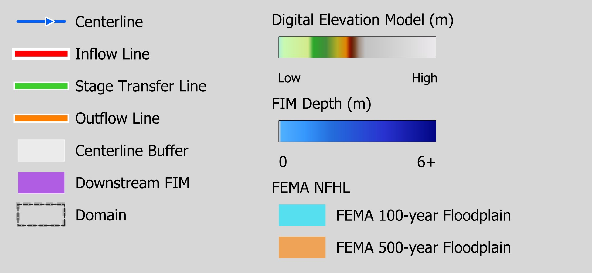
Figure 7. Symbology used for pilot modeling maps
### Pilot Cases
Pilot locations were selected to stress the methodology and different design decisions across contrasting hydraulic and physiographic conditions rather than to maximize geographic count. The set includes small rural systems, steep headwaters, urban/structure-influenced corridors, very wide floodplains, arid channels, different shape confluences or river networks, and lake/coastal terminal settings. The baseline methodology as well targeted deviation experiments were then executed against these cases to discover and isolate failures modes such as WSEL mismatch at tie-ins, edge leakage, inflow artifacts, etc. This is inline with SDR workflow described above.

Figure 8 depicts location of all cases. Table 3 provides case number, location, and title for these cases. Appendix C provides full details for each case.

*![[Pasted image 20260216133325.png]]Figure 8. Locations of pilot study cases. For full detail about each case refer to Appendix C.

**Table 3. Case Index**

| Case Number | Location | Title |
| --- | --- | --- |
| Case-1 | Haddam, CT | Y Shape Confluence with 2 Level Stream Order Difference |
| Case-2 | Burlington, VT | Lake Reach |
| Case-3 | Winooski, VT | Small Culverts |
| Case-4 | Burlington, VT | Model Domain Example |
| Case-5 | Richmond, VT | Model Domain Example 2 |
| Case-6 | Springfield, MA | Inflow Boundary Conditions |
| Case-7 | Binghamton, NY | Complex Semi-urban Confluence Along Low-Gradient River |
| Case-8 | Rosedale, MS | Very Wide Floodplain |
| Case-9 | Brinson, GA | Rural Unconfined Farm Fields |
| Case-10 | Quartz, CO | Steep confined Mountainous Terrain |
| Case-11 | Trenton, NJ | Large Urban River |
| Case-12 | Hiko, NV | Desert Wash |
| Case-13 | Lake Murray, SC | Large Inland Waterbody |
| Case-14 | Plum Island, MA | Coastal Area |
| Case-15 | Evansville, IN | Large River |

### Key Decisions for Automation
Initial pilots used a simple baseline: model each reach independently, apply straightforward boundary conditions, and rely on downstream-to-upstream sequencing for hydraulic coupling. That baseline exposed predictable weaknesses. The decisions below summarize how those weaknesses were addressed and how they now shape the methodology.

#### Reach Coupling and Stage Transfer
The first major decision was whether downstream stage transfer (KWSE-informed coupling) was necessary or whether normal-depth downstream boundaries were sufficient. In confluences and stream-order mismatch settings, normal-depth-only runs consistently underpredicted downstream water-surface elevation and reduced upstream inundation extent. Stage-transfer-informed runs produced better tie-in behavior and more realistic backwater response.

As a result, downstream stage transfer is currently treated as a default requirement across reaches, not a special-case exception. This aligns with Flows2FIM’s downstream-to-upstream traversal logic and preserves compatibility with library-based operational assembly.

*Figure TBD. KWSE vs normal-depth comparison showing lower WSEL near tie-in without downstream stage transfer.*

#### Domain Edge and Boundary-Control Strategy
Applying normal depth across all perimeter edges was tested early and consistently created non-physical losses where upstream tributaries or side boundaries intersected the domain edge. The current approach restricts normal-depth outflow treatment to edge cells hydraulically informed by downstream flooding and uses reach-centerline slope for those cells. This materially reduced leakage at non-outlet locations.

For lake and coastal terminal settings, normal-depth-only boundaries also produced pooling artifacts. Current handling uses waterbody-informed edge treatment and stage-transfer-aware downstream control, with STL geometry tied to domain-waterbody intersection. Reach classification rules for lake/coastal tagging remain open.

*Figure TBD. Water leaving the domain at non-outlet locations when normal depth is applied at all edges.*

*Figure TBD. Lake reach behavior under normal-depth boundary conditions.*

*Figure TBD. Lake reach behavior under downstream stage transfer.*

#### Stage Transfer Line (STL) Placement
Tests showed that applying stage transfer directly at the outer domain edge can create abrupt hydraulic behavior where downstream geometry or flow regime changes quickly. Using an internal STL derived from downstream WSEL contours produced more stable transitions. The current selection is one STL per reach, derived from coarse-model guidance and reused across runs for that reach.

This simplifies automation and indexing, but it introduces residual risk in highly flat or hydraulically complex reaches where one STL may not represent all flow regimes equally well.

*Figure TBD. Alternative STL placement geometry to reduce WSEL anomalies.*

#### Domain Construction and Expansion
Reach-divide-only domains were frequently too narrow, causing floodplain truncation and edge cutoffs. The current method starts from buffered/coarse-informed geometry and then applies elevation-informed expansion rules until edge flooding is limited relative to outlet elevation constraints. This improved continuity without defaulting to excessively large domains.

*Figure TBD. Flood extent truncated at domain edge when using reach-divide domains.*

*Figure TBD. Comparison to benchmark FIM showing edge truncation.*

#### Inflow Representation and Special Reach Handling
Point inflows at the reach start produced recurring bullseye artifacts in WSEL contours. A perpendicular inflow line on the upstream mainstem reduced these artifacts and produced smoother fields. Current defaults are a 100 m inflow line width with a 0.25 upstream-reach-length offset. Headwater treatment remains a conditional area where point inflow may still be used but requires additional constraints.

Short and hydraulically flat reaches were also problematic when modeled strictly one-by-one. Current practice merges selected continuous short reaches (based on stream order, drainage-area difference, and length thresholds) to avoid artificial segmentation effects. Flat-reach handling is still provisional and requires further rule development.

*Figure TBD. Point inflow producing WSEL “bullseye” artifacts.*

*Figure TBD. Line inflow reduces WSEL artifacts.*

#### Terrain Conditioning and Hydraulic Realism
Unconditioned DEMs repeatedly produced divergent flow paths and impoundment around culverts and road crossings that were not hydraulically represented in the terrain. This behavior is severe enough that a no-conditioning approach is not considered viable for production. Alternatives under evaluation include AGREEDEM channel burning, targeted road/culvert burning, and hybrid conditioning workflows.

*Figure TBD. Divergent flowpath caused by unburned culverts.*

*Figure TBD. Flow impounded upstream of a culvert/road crossing.*

#### Compositing, Run Control, and Remaining Open Decisions
For compositing overlapping reach rasters, the current selection is pixelwise maximum depth. This is robust and simple for operational assembly, but it can amplify local artifacts when upstream boundary errors persist.

Quasi-steady termination criteria are still open and currently treated as a proposed decision. Candidate criteria include combined mass-balance convergence (Qin approximately equal to Qout) and WSEL stabilization across final timesteps.

At the time of this report, principal open SDR items include lake/coastal reach classification logic, final DEM-conditioning method, initial-domain rule finalization, and quasi-steady stopping criteria. These are expected to be resolved during prototype automation and are the main prerequisites for moving from methodology definition to production-scale implementation.

Together, these decisions define the current method baseline and directly inform the proposed automation workflow in the next section.

## Proposed Automation Workflow
This workflow is under development and will be refined as decisions are finalized. It is designed to translate the methodology into a repeatable national-scale pipeline.

*Figure TBD. Proposed production framework for automated 2D FIM libraries.*

### Coarse Modeling
Coarse simulations are used to estimate maximum flood extents and to derive a hydraulic reach network that reflects actual inundation sources. Coarse outputs also seed initial stage surfaces for lake/coastal reaches and help identify areas where the simple reach-based framework is likely to fail.

*Figure TBD. Coarse modeling workflow used to inform reach network and STL placement.*

### Initial Model Creation
For each reach, the pipeline generates inflow geometry, a model domain, a stage transfer line, and initial raster inputs. DEM and roughness rasters are prepared at 10 m resolution, and conditioning rules are applied where culverts or obstructions are likely. Domain expansion rules ensure that flood extents are not truncated at model edges.

*Figure TBD. Initial model creation workflow.*

### Simulation Execution
Simulation files are generated automatically for each discharge and downstream stage combination. Runs proceed downstream-to-upstream to propagate stage transfer. Quasi-steady state is evaluated using a consistent criterion. Outputs are converted into FIM rasters and stored as per-reach libraries for later mosaicking.

### Data Model
From an operational standpoint, the library structure should remain consistent with Flows2FIM conventions: a directory per reach, subdirectories per downstream stage (WSE) level, and discharge‑indexed rasters (plus a domain mask). Maintaining this structure ensures libraries remain composable in near real time and simplifies cloud storage and retrieval.

[talk about data model]

*Figure TBD. Simulation execution workflow.*

## Step-by-Step Example
[Placeholder: worked example with embedded QGIS maps and model inputs/outputs.]

### Comparison with 2D Map for the Area
[Placeholder: side-by-side comparison and discussion of differences.]

## Limitations and Challenges
Even with the current decisions, several issues remain recurring or require special handling. These limitations inform both the current methodology and the open decisions to be resolved during the prototype phase.

### Lack of Bathymetric Data
Effects of bathymetric data absence/presence on 2D model results.

Here, we looked at the Ohio River near Evansville, IN. Bathymetric data came from USACE eHydro. We ran a series of discharges through the 2D models for this reach and measured the resulting water surface elevations at the USGS gage here.

Results show that the “with bathymetry” model tracks closer to the observed USGS data, especially in lower‑magnitude floods. Notably, the “without bathymetry” model is above the minor flood stage for almost all discharges whereas the “with bathymetry” model only gets to minor flood stage at a ~2‑year event.

In large‑scale implementations, a common workaround is to omit explicit bathymetry and represent river channels as **sub‑grid features** within each 2D cell. In practice, this means the grid cell stores an idealized 1D channel geometry (width, depth, roughness) so flow and storage can be approximated without resolving the channel in the terrain. This can reduce data requirements and improve runtime, but it also shifts accuracy to the quality of the sub‑grid parameterization. For our workflow, this highlights a tradeoff: either invest in bathymetric data where available, or adopt sub‑grid channel representations and quantify the resulting bias, especially for lower‑magnitude flows.

*Figure TBD. Ohio River (Evansville) comparison of WSEL with and without bathymetry.*

### Boundary Condition Artifacts
Water‑surface elevation anomalies can occur near inflow boundaries in certain geometries, and non‑physical outflows can occur when edge boundary conditions are too permissive. These artifacts can propagate into composite maps if not controlled by boundary placement, domain sizing, and STL geometry.

### Domain Truncation and Edge Effects
Domains derived strictly from reach divides can truncate flood extents and cause edge pooling. Expansion rules mitigate this, but automation remains sensitive to local topography and floodplain width.

### Confluence Sensitivity
Backwater effects and confluence geometry can produce narrower‑than‑expected FIM extents if downstream stage transfer is not enforced or if STL coverage is incomplete across the floodplain.

### Flat and Hydraulically Coupled Reaches
Flat reaches and hydraulically coupled reaches challenge the reach‑based assumption, particularly where stage changes propagate across multiple reaches or where level‑pool behavior dominates.

### Compute and Cost
Large rivers and wide floodplains can require large domains or reach eclipsing, which affects compute time, storage, and cost. This will need explicit optimization in the prototype phase.

### Volume‑Driven Areas
Some areas respond more to flood volume than peak discharge (e.g., lakes, reservoirs, and extensive floodplains). These settings require alternative handling beyond discharge‑only library selection.

Taken together, these limitations do not negate the approach. They clarify where automation needs guardrails and targeted exceptions so the system remains fit for rapid, decision‑support mapping.

## Discussion and Next Steps
This report proposes a defensible, automatable methodology grounded in pilot evidence and a structured decision process. The next phase will refine open decisions, select a production model, and implement a prototype pipeline for a HUC6-scale area. The SDR system will continue to capture decision evolution, ensuring that methodology changes are traceable and evidence-based.

The approach described here represents a significant compute effort relative to existing GIS or 1D workflows. As a result, near‑term work should prioritize optimization of methodology and cost over expanding library coverage. In practice, this means focusing on the performance envelope of the system before scaling further. Key optimization areas include model choice and solver configuration, CPU vs GPU execution trade‑offs, domain sizing and reach merging rules, use of sub‑grid or multi‑resolution techniques where appropriate, and I/O strategies that avoid writing or storing data outside the flood‑relevant extent. Decisions in these areas have outsized impacts on cost, throughput, and the feasibility of national‑scale production.

We therefore recommend a dedicated optimization and benchmarking effort in the next phase, using a prototype HUC6 to compare candidate models and configurations on representative hardware. The goal is to establish cost‑per‑reach and cost‑per‑library targets, identify bottlenecks, and refine automation rules (domain trimming, reach eclipsing, data reduction) before committing to large‑scale library generation.

Recommended next steps are best framed as a short‑term roadmap tied to time, with an emphasis on optimization before scale. A suggested sequencing is below; durations are placeholders to be adjusted based on staffing and compute availability.

**Suggested Roadmap (Time‑Phased)**
| Phase | Timing (Placeholder) | Primary Focus | Key Outputs |
| --- | --- | --- | --- |
| Phase 1 | 0–2 months | Benchmarking and cost modeling | Model speed/cost comparison (CPU vs GPU); solver configuration sensitivity; cost‑per‑reach and cost‑per‑library targets |
| Phase 2 | 2–4 months | Methodology closure | Decisions finalized for quasi‑steady state, inflow geometry, STL placement, lake/coastal classification; QA/QC acceptance metrics defined |
| Phase 3 | 4–6 months | Automation hardening | Domain expansion rules validated; reach‑merging/eclipsing criteria refined; terrain‑conditioning workflows integrated |
| Phase 4 | 6–9 months | Prototype production | End‑to‑end HUC6 pipeline run; data‑reduction strategies tested; comparison to HAND/Ripple1D baselines |

SDR updates should accompany each phase to keep decision rationale traceable.

## References
Bates, P. D., and A. P. J. De Roo (2000), A simple raster‑based model for flood inundation simulation, *Journal of Hydrology*, 236, 54–77, https://doi.org/10.1016/S0022-1694(00)00278-X.

Baugh, C., J. Colonese, C. D'Angelo, F. Dottori, J. Neal, C. Prudhomme, and P. Salamon (2024), Global river flood hazard maps, European Commission, Joint Research Centre (JRC) [Dataset], http://data.europa.eu/89h/jrc-floods-floodmapgl_rp50y-tif (accessed 12 Feb 2026).

Eilander, D., et al. (2023a), HydroMT: Automated and reproducible model building and analysis, *Journal of Open Source Software*, 8(83), 4897, https://doi.org/10.21105/joss.04897.

Eilander, D., et al. (2023b), A globally applicable framework for compound flood hazard modeling, *Natural Hazards and Earth System Sciences*, 23, 823–, https://doi.org/10.5194/nhess-23-823-2023.

NextGen Water Prediction Capabilities (NGWPC) (n.d.-a), Ripple1D (software), GitHub repository, https://github.com/NGWPC/ripple1d (accessed 12 Feb 2026).

NextGen Water Prediction Capabilities (NGWPC) (n.d.-b), flows2fim (software), GitHub repository, https://github.com/NGWPC/flows2fim (accessed 12 Feb 2026).

Sanders, B. F., O. E. J. Wing, and P. D. Bates (2024), Flooding is not like filling a bath, *Earth’s Future*, 12(12), e2024EF005164, https://doi.org/10.1029/2024EF005164.

Siddiqui, A. R. (n.d.), System Decision Records (SDR), https://ar-siddiqui.github.io/sdr/ (accessed 16 Feb 2026).

U.S. Army Corps of Engineers (USACE) (n.d.), HEC-RAS 2D User’s Manual: Creating land cover, Manning’s n values, and impervious layers, https://www.hec.usace.army.mil/confluence/rasdocs/r2dum/6.6/developing-a-terrain-model-and-geospatial-layers/creating-land-cover-mannings-n-values-and-impervious-layers (accessed 15 Feb 2026).

U.S. Geological Survey (n.d.-a), Flood Inundation Mapping (FIM) Program, https://www.usgs.gov/mission-areas/water-resources/science/flood-inundation-mapping-fim-program (accessed 12 Feb 2026).

U.S. Geological Survey (n.d.-b), Flood Inundation Mapping Science, https://www.usgs.gov/mission-areas/water-resources/science/flood-inundation-mapping-science (accessed 12 Feb 2026).

Wing, O. E. J., et al. (2019), A flood inundation forecast of Hurricane Harvey using a continental‑scale 2D hydrodynamic model, *Journal of Hydrology X*, 4, 100039, https://doi.org/10.1016/j.hydroa.2019.100039.

## Appendices

### Appendix A.

### Appendix B. Glossary
#### Adjacent Reaches
`connected reaches` and reaches draining into the same `reach outlet` for the reach of interest.

All blue reaches are `adjacent reaches` for green reach.
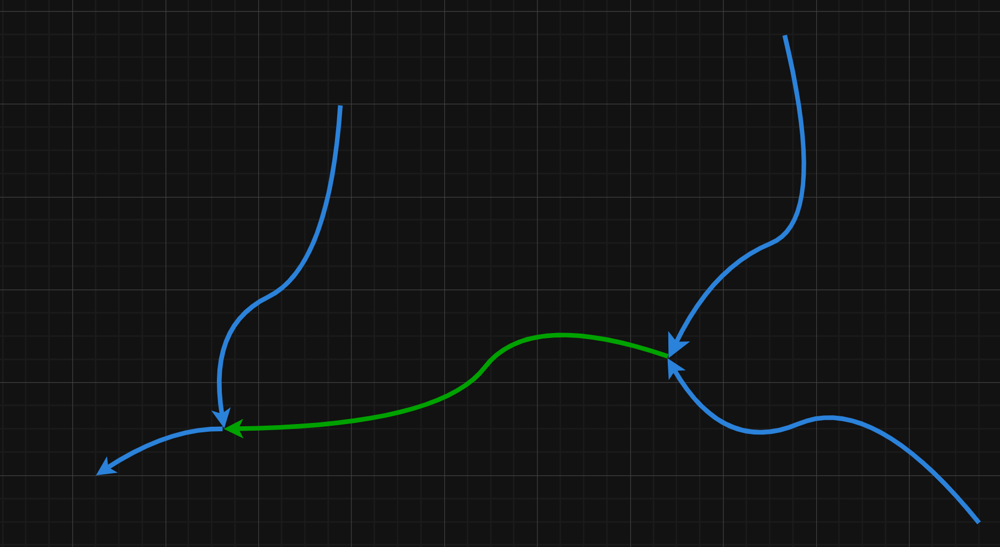
*Figure B1. `Adjacent Reaches` example.*

#### Common Outlet Reaches
Reaches sharing common `reach outlet`.

Two green reaches here are common outlet reaches because they share same `reach outlet`.
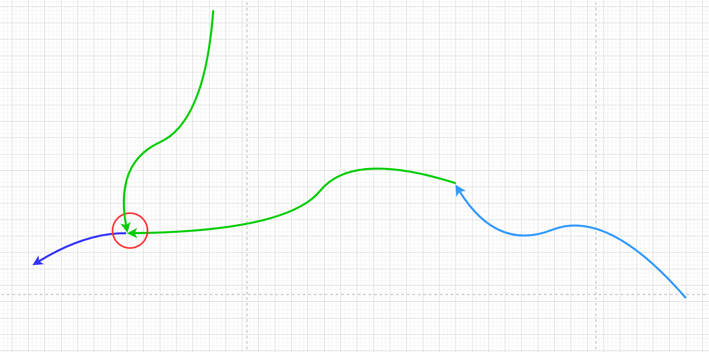
*Figure B2. `Common Outlet Reaches` example.*

#### Connected Reaches
Reaches connected to a reach through upstream or downstream relationship.

All blue reaches are `connected reaches` for green reach. Note that red reach is not.
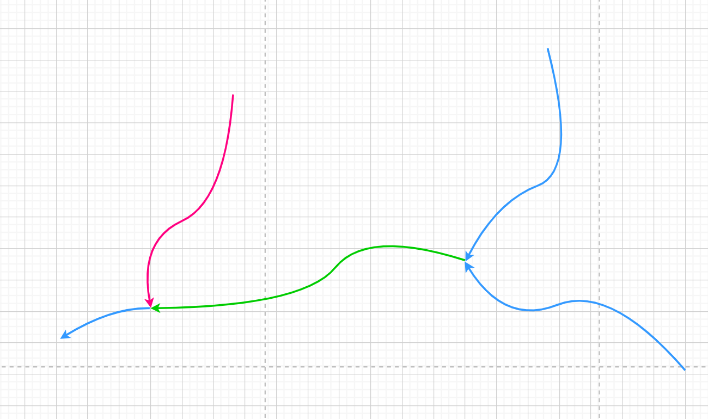
*Figure B3. `Connected Reaches` example.*

#### FIM Transition Zone
The `Transition Zone` for a reach is the area between the `Stage Transfer Line` and the outflow line.

The yellow area in the image below shows the `Transition Zone` for this reach.

*Figure B4. `FIM Transition Zone` (yellow area).*

#### Headwater Reaches
Reaches that have no reaches upstream of them in the reach network.

`headwater reaches` shown in green
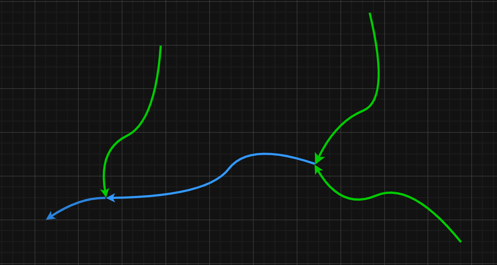
*Figure B5. `Headwater Reaches` shown in green.*

#### Lake and Coastal Reaches
Subset of `Terminal Reaches` that discharge to
- coasts
- large waterbodies

#### Reach Outlet
End point of the reach.

Reach outlet for green reach shown in red circle.
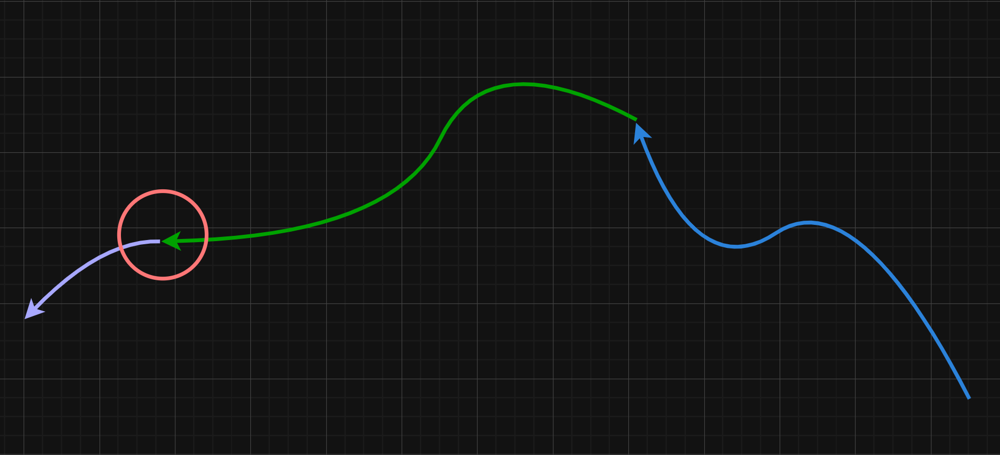
*Figure B6. `Reach Outlet` shown for green reach (red circle).*

#### Reach Start
Start point of the reach.

Reach start for green reach shown in red circle.
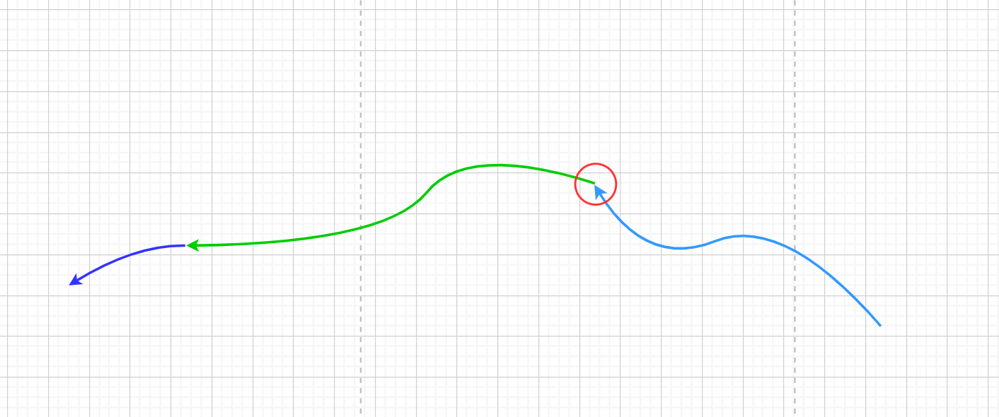
*Figure B7. `Reach Start` shown for green reach (red circle).*

#### Stage Transfer Line (STL)
A line that is within the domain of both upstream and downstream reach models and which is used to transfer WSEL from the downstream model to an upstream model.

#### Terminal Reaches
Terminal reaches include reaches that discharge to
- coasts
- areas outside the US
- large waterbodies

#### Upstream Mainstem Reach
The reach with the largest drainage area of all `upstream reaches` for a reach of interest.

#### Upstream Reach
A reach that drain to a reach of interest.

### Appendix C. Pilot Cases
All figures in this appendix follow the same symbology convention described in Figure 7, unless overridden by Figure caption.

#### CASE #1 - Y Shape Confluence with 2 Level Stream Order Difference

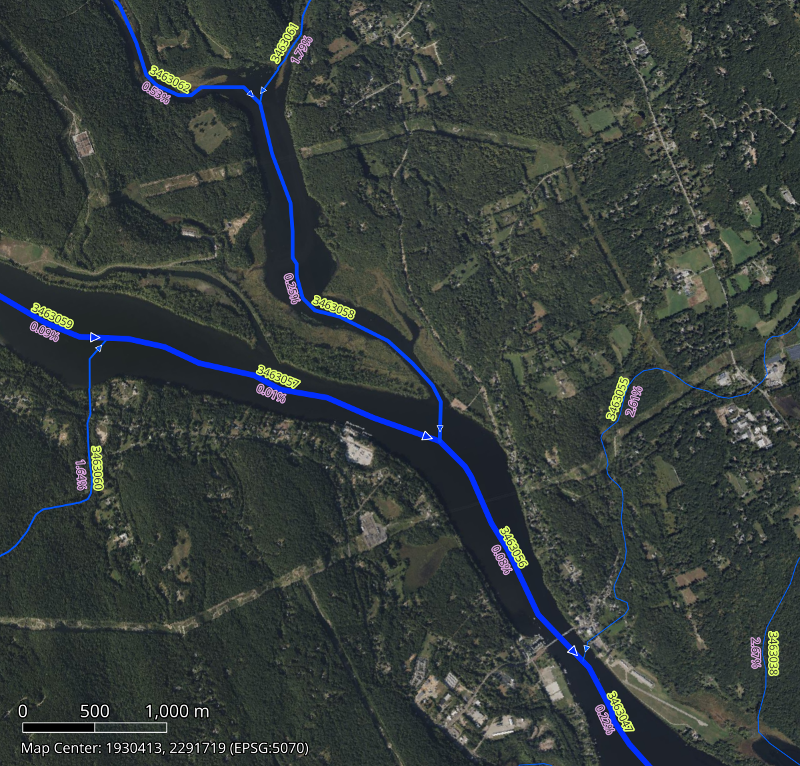
*Figure C1. Representative view for CASE #1.*

| Fact | Value |
| --- | --- |
| Case Number | Case-1 |
| Location | Haddam, CT |
| Date Observed | 2026-01-22 |
| Coordinates (EPSG:5070) | 1930357, 2289467 |
| Coordinates (EPSG:4326) | 41.466439,-72.470839 |
| Flows (cms) | 500, 6000 |
| Stream Orders | 4, 6 |

**Description**
This case was selected to evaluate confluence behavior where stream-order mismatch and low-gradient backwater make downstream stage handling sensitive.

#### CASE #2 - Lake Reach

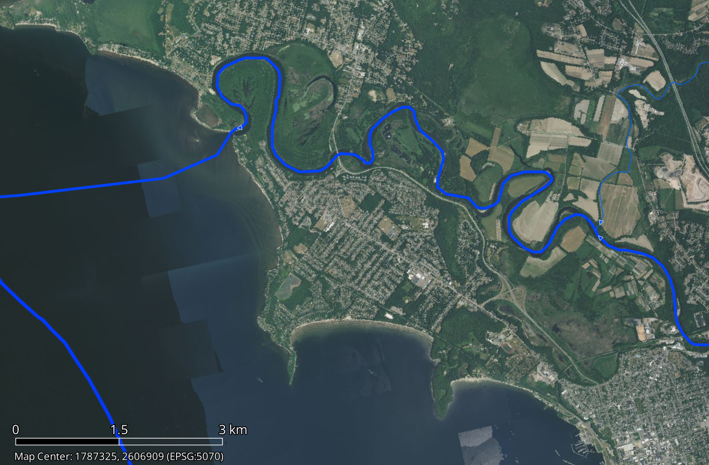
*Figure C2. Representative view for CASE #2.*

| Fact | Value |
| --- | --- |
| Case Number | Case-2 |
| Location | Burlington, VT |
| Date Observed | 2026-01-27 |
| Coordinates (EPSG:5070) | 1786548, 2606475 |
| Coordinates (EPSG:4326) | 44.522842,-73.251503 |
| Flows (cms) | 2680 |
| Stream Orders | 4 |

**Description**
This case represents a terminal reach discharging into Lake Champlain and was selected to evaluate boundary-condition behavior in lake-connected settings.

#### CASE #3 - Small Culverts

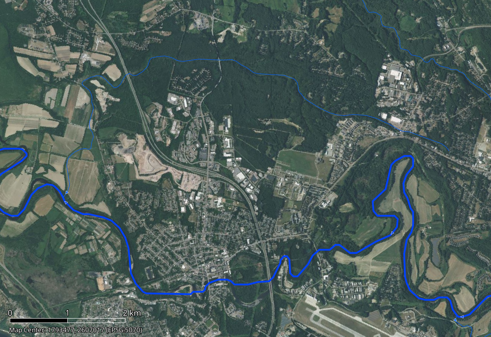
*Figure C3. Representative view for CASE #3.*

| Fact | Value |
| --- | --- |
| Case Number | Case-3 |
| Location | Winooski, VT |
| Date Observed | 2026-01-27 |
| Coordinates (EPSG:5070) | 1796329.9, 2607407.4 |
| Coordinates (EPSG:4326) | 44.505228,-73.140441 |
| Flows (cms) | 36.75 |
| Stream Orders | 1 |

**Description**
This case was selected to evaluate terrain-conditioning needs where unresolved small culverts can cause divergent flow paths and upstream impoundment.

#### CASE #4 - Model Domain Example

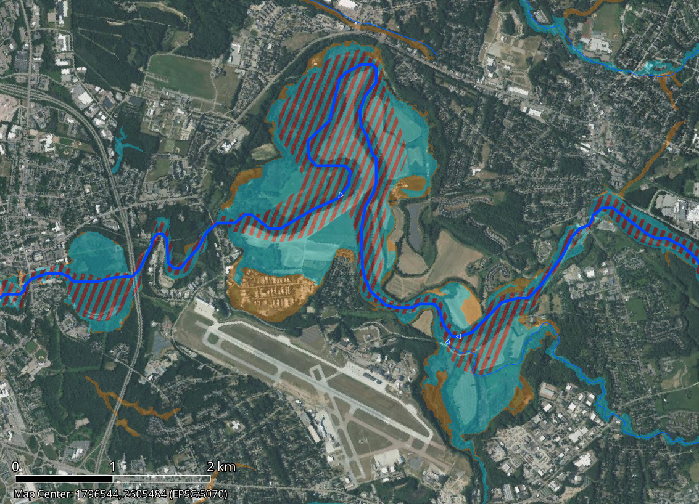
*Figure C4. Representative view for CASE #4.*

| Fact | Value |
| --- | --- |
| Case Number | Case-4 |
| Location | Burlington, VT |
| Date Observed | 2026-01-27 |
| Coordinates (EPSG:5070) | 1798555, 2602987 |
| Coordinates (EPSG:4326) | 44.48438,-73.14014 |
| Flows (cms) | 2344 |
| Stream Orders | 4 |

**Description**
This case was selected to test model-domain construction where overbank floodplain extent lies far from the channel and can be clipped by narrow domain rules.

#### CASE #5 - Model Domain Example 2

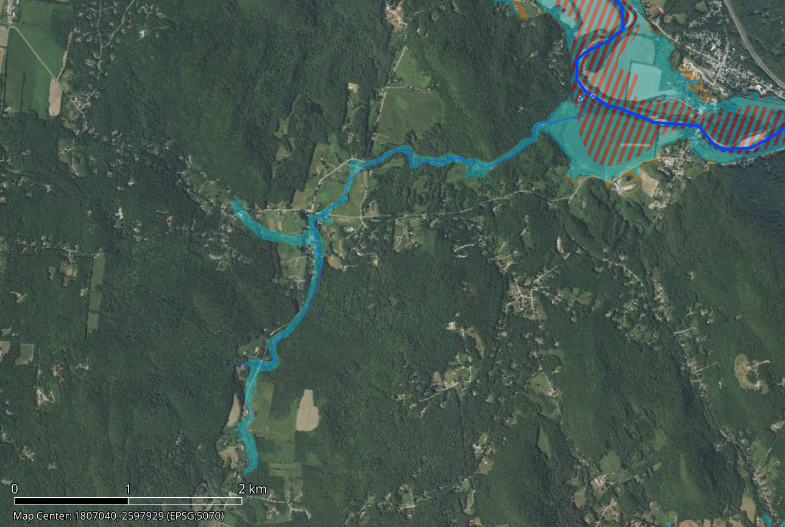
*Figure C5. Representative view for CASE #5.*

| Fact                    | Value                |
| ----------------------- | -------------------- |
| Case Number             | Case-5               |
| Location                | Richmond, VT         |
| Date Observed           | 2026-01-27           |
| Coordinates (EPSG:5070) | 1811265, 2594919     |
| Coordinates (EPSG:4326) | 44.402896,-73.035427 |
| Flows (cms)                   | 52.8                 |
| Stream Orders           | 1                    |

**Description**
This case was selected to examine headwater tributary confluence behavior where water can pool near a common outlet, affecting automated domain-expansion logic.

#### CASE #6 - Inflow Boundary Conditions

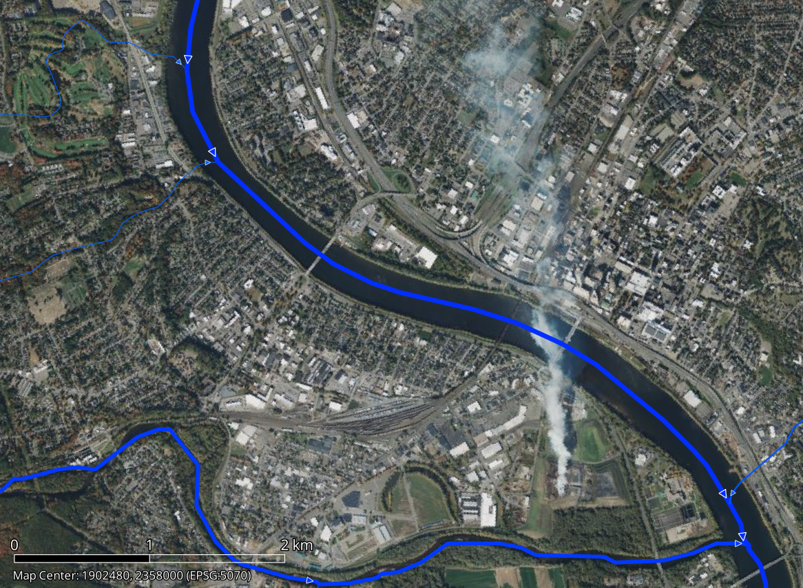
*Figure C6. Representative view for CASE #6.*

| Fact | Value |
| --- | --- |
| Case Number | Case-6 |
| Location | Springfield, MA |
| Date Observed | 2026-02-04 |
| Coordinates (EPSG:5070) | 1903629, 2354784 |
| Coordinates (EPSG:4326) | 42.105287,-72.608837 |
| Flows (cms) | 13500 |
| Stream Orders | 6 |

**Description**
This mid-sized river case was selected to test upstream inflow-boundary geometry and placement effects on WSEL artifacts; discharges were based on USGS 01172000.

#### CASE #7 - Complex Semi-urban Confluence Along Low-Gradient River

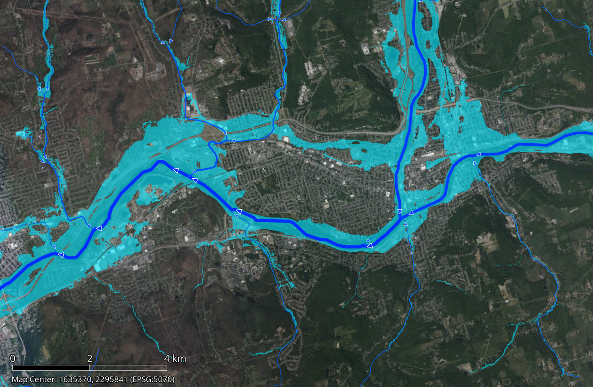
*Figure C7. Representative view for CASE #7.*

| Fact | Value |
| --- | --- |
| Case Number | Case-7 |
| Location | Binghamton, NY |
| Date Observed | 2026-02-05 |
| Coordinates (EPSG:5070) | 1633164, 2293585 |
| Coordinates (EPSG:4326) | 42.10646,-75.95026 |
| Flows (cms) | 4240 |
| Stream Orders | 6 |

**Description**
This case was selected to stress methodology in a complex low-gradient semi-urban confluence with multiple tributaries and levee influences.

#### CASE #8 - Very Wide Floodplain

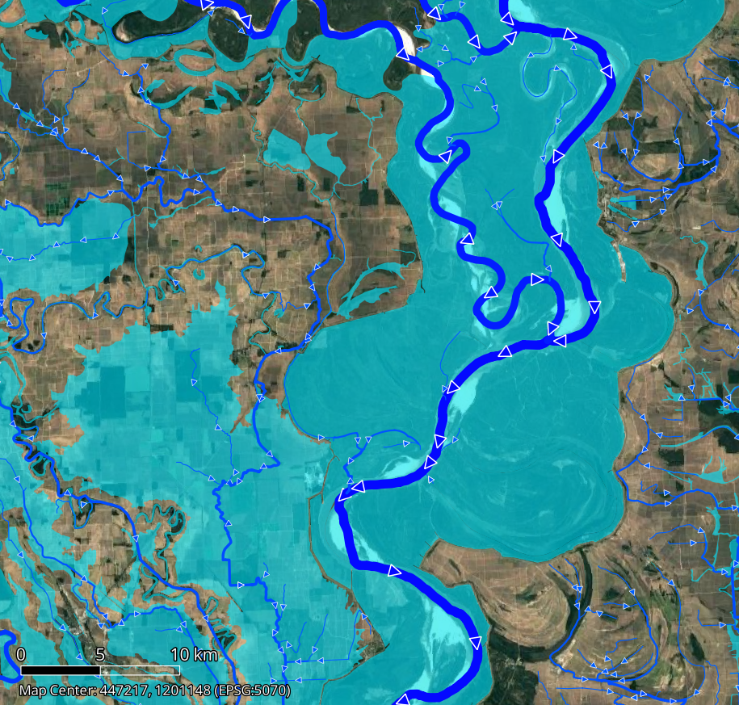
*Figure C8. Representative view for CASE #8.*

| Fact                    | Value              |
| ----------------------- | ------------------ |
| Case Number             | Case-8             |
| Location                | Rosedale, MS       |
| Date Observed           | 2026-02-09         |
| Coordinates (EPSG:5070) | 449756,1201331     |
| Coordinates (EPSG:4326) | 33.74552,-91.13034 |
| Flows (cms)             | N/A                |
| Stream Orders           | 10                 |

**Description**
This case was selected to test very wide-floodplain behavior along the Mississippi River, where floodplain widths of roughly 12–22 km challenge domain and boundary rules.

#### CASE #9 - Rural Unconfined Farm Fields

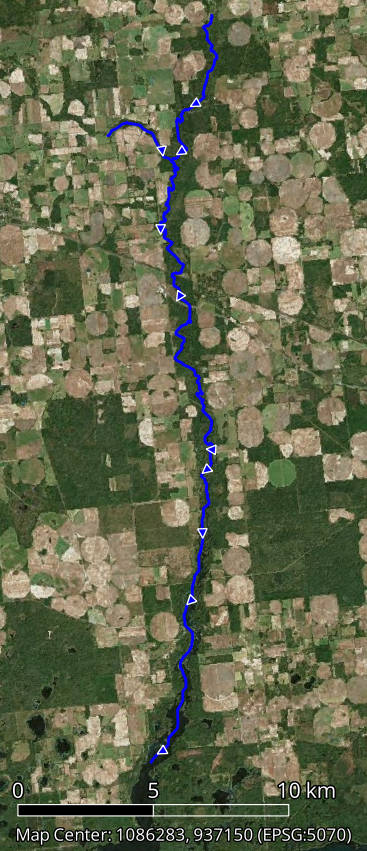
*Figure C9. Representative view for CASE #9.*

| Fact                    | Value              |
| ----------------------- | ------------------ |
| Case Number             | Case-9             |
| Location                | Brinson, GA        |
| Date Observed           | 2026-02-11         |
| Coordinates (EPSG:5070) | 1070234,936890     |
| Coordinates (EPSG:4326) | 30.93866,-84.74584 |
| Flows (cms)             | N/A                |
| Stream Orders           | 3, 1               |

**Description**
This case was selected to evaluate methodology performance in small, rural, unconfined agricultural channels.

#### CASE #10 - Steep confined Mountainous Terrain

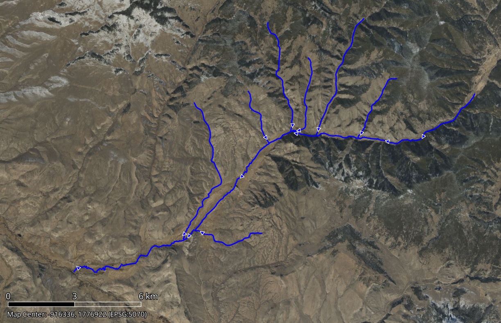
*Figure C10. Representative view for CASE #10.*

| Fact                    | Value               |
| ----------------------- | ------------------- |
| Case Number             | Case-10             |
| Location                | Quartz, CO          |
| Date Observed           | 2026-02-11          |
| Coordinates (EPSG:5070) | -915338,1776607     |
| Coordinates (EPSG:4326) | 38.56847,-106.61573 |
| Flows (cms)             | N/A                 |
| Stream Orders           | 4, 1                |

**Description**
This case was selected to evaluate steep, confined mountainous terrain with multiple tributary inflows.

#### CASE #11 - Large Urban River

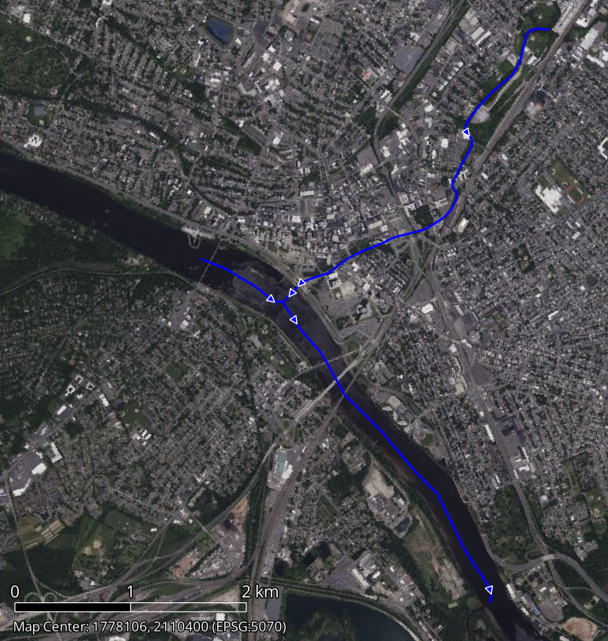
*Figure C11. Representative view for CASE #11.*

| Fact                    | Value                |
| ----------------------- | -------------------- |
| Case Number             | Case-11              |
| Location                | Trenton, NJ          |
| Date Observed           | 2026-02-11           |
| Coordinates (EPSG:5070) | 1776154.1,2110466.2  |
| Coordinates (EPSG:4326) | 40.215714,-74.770855 |
| Flows (cms)             | N/A                  |
| Stream Orders           | 6, 3                 |

**Description**
This case was selected as a large urban-river testbed to assess structure-influenced hydraulics and culvert/bridge handling strategies.

#### CASE #12 - Desert Wash

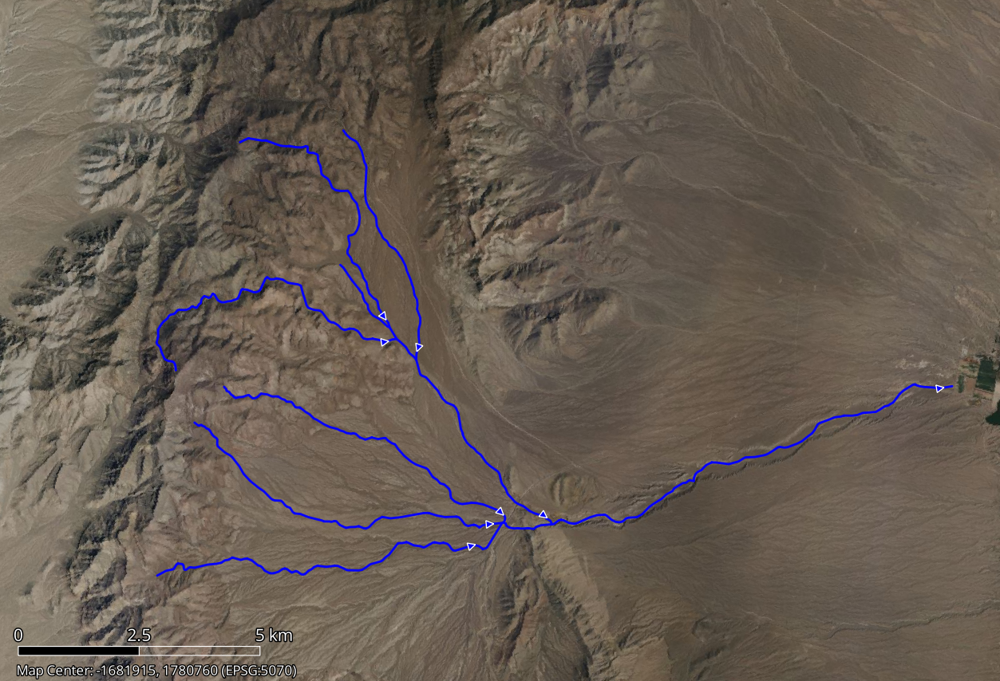
*Figure C12. Representative view for CASE #12.*

| Fact                    | Value               |
| ----------------------- | ------------------- |
| Case Number             | Case-12             |
| Location                | Hiko, NV            |
| Date Observed           | 2026-02-12          |
| Coordinates (EPSG:5070) | -1681776,1777038    |
| Coordinates (EPSG:4326) | 37.49279,-115.34133 |
| Flows (cms)             | N/A                 |
| Stream Orders           | 3, 2, 1             |

**Description**
This case was selected to evaluate desert-wash behavior, where nonstandard morphology and adjacent-reach interactions can challenge hydrofabric-based domain logic.

#### CASE #13 - Large Inland Waterbody

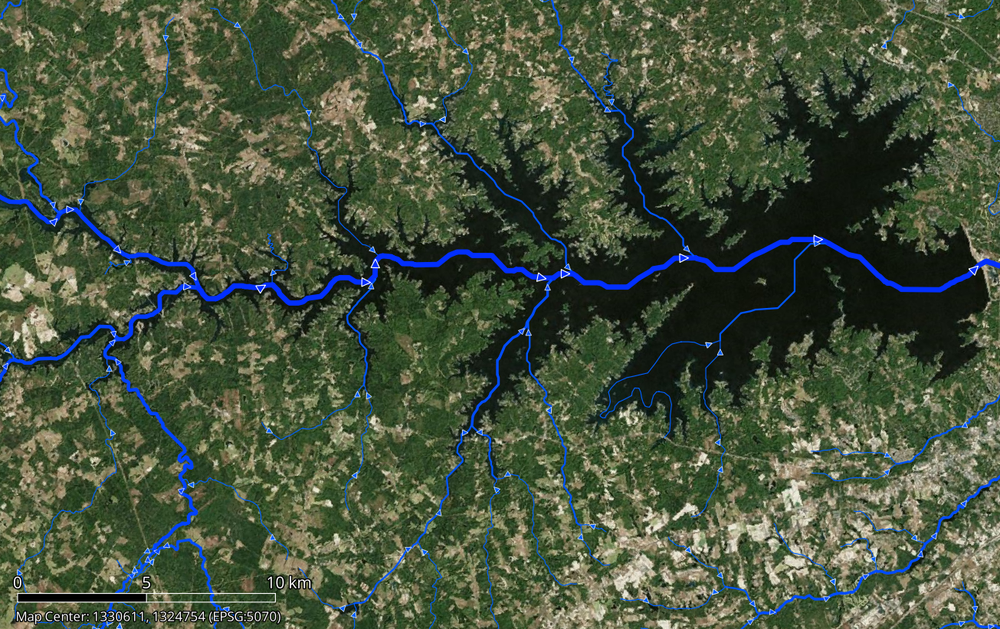
*Figure C13. Representative view for CASE #13.*

| Fact                    | Value              |
| ----------------------- | ------------------ |
| Case Number             | Case-13            |
| Location                | Lake Murray, SC    |
| Date Observed           | 2026-02-12         |
| Coordinates (EPSG:5070) | 1334048,1325182    |
| Coordinates (EPSG:4326) | 34.06732,-81.37340 |
| Flows (cms)             | N/A                |
| Stream Orders           | 1, 2, 5, 6         |

**Description**
This case was selected to develop and test methodology for large inland waterbody settings such as lakes and reservoirs.

#### CASE #14 - Coastal Area

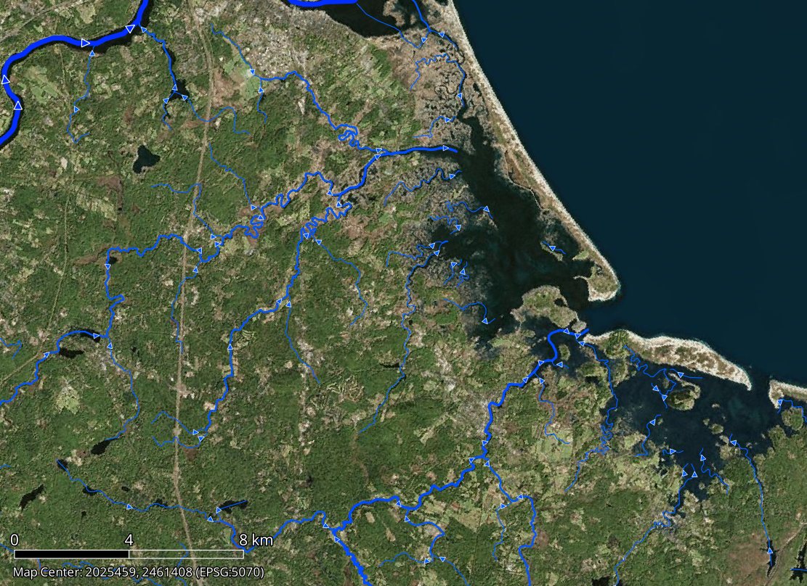
*Figure C14. Representative view for CASE #14.*

| Fact                    | Value              |
| ----------------------- | ------------------ |
| Case Number             | Case-14            |
| Location                | Plum Island, MA    |
| Date Observed           | 2026-02-12         |
| Coordinates (EPSG:5070) | 2025825,2462203    |
| Coordinates (EPSG:4326) | 42.72671,-70.81783 |
| Flows (cms)             | N/A                |
| Stream Orders           | 1, 2, 3            |

**Description**
This case was selected to develop and test methodology for coastal boundary settings.

#### CASE #15 - Large River

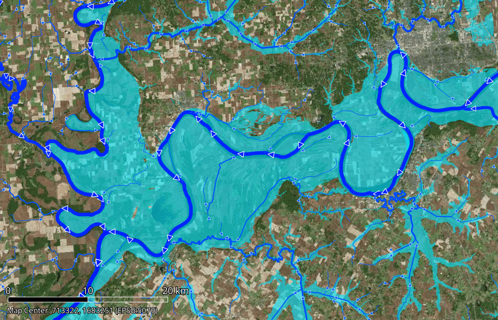
*Figure C15. Representative view for CASE #15.*

| Fact                    | Value              |
| ----------------------- | ------------------ |
| Case Number             | Case-15            |
| Location                | Evansville, IN     |
| Date Observed           | 2026-02-12         |
| Coordinates (EPSG:5070) | 716490,1679388     |
| Coordinates (EPSG:4326) | 37.87805,-87.75769 |
| Flows (cms)             | N/A                |
| Stream Orders           | 7                  |

**Description**
This case was selected as a large-river testbed with a wide floodplain and available surveyed bathymetry to evaluate domain rules and stage behavior.
