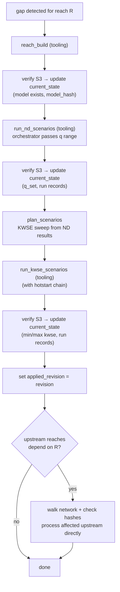
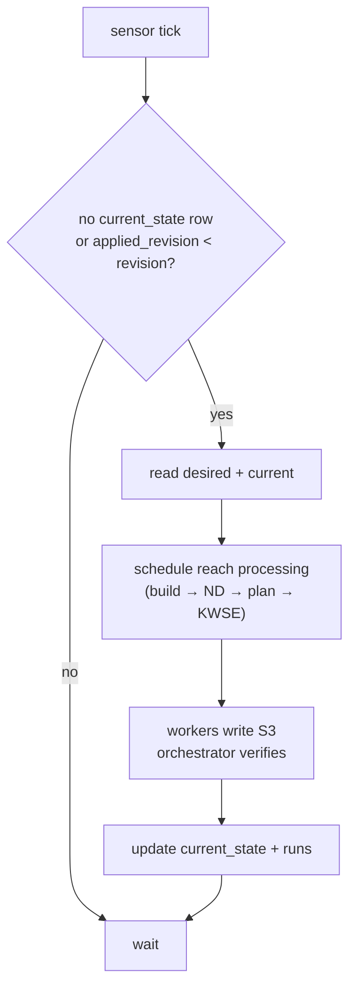
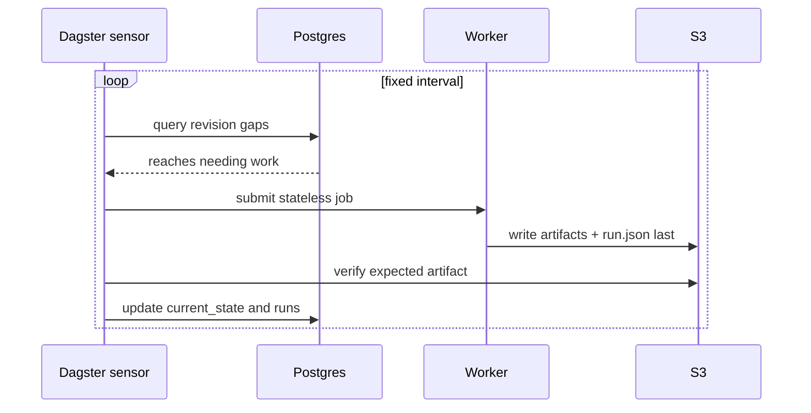
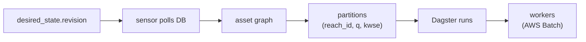

# Orchestrator Design

Detailed schemas, paths, and worker signatures in [`specs/pipeline-contracts.md`](specs/pipeline-contracts.md) and [`specs/triggers-and-propagation.md`](specs/triggers-and-propagation.md).

## Reach Processing (cold start)

Upstream reaches are processed as part of the original trigger's scope — their `desired_state.revision` is not bumped. If the orchestrator crashes mid-cascade, periodic S3 rescan detects completed artifacts and syncs `current_state`.

## Reconciliation Loop

Each tick moves current state toward desired state. Content-addressed paths make the loop safe to retry.

`desired_state.revision` only changes from external events (config change, manual request). The loop detects the gap and processes the reach, including any upstream cascade.

## DB Listening

Polling is primary — simple, observable, guaranteed progress.

| Mechanism | Role |
|---|---|
| Polling | Primary. Finds `applied_revision < revision` gaps. |
| S3 verification | Required. Confirms artifact before DB advances. |
| Periodic S3 rescan | Safety net. Repairs DB/S3 drift and crash recovery during upstream cascade. |
| LISTEN/NOTIFY | Optional. Wakes poller faster. |

## Dagster Fit

| Option | Fit | Why |
|---|---|---|
| **Dagster** | Strong | Asset materialization + partition state = desired vs current. Built-in sensors, run cancellation, backfills, UI. |
| Airflow | Weaker | DAG-run oriented. No native asset staleness or partition catalog. |
| Prefect | Weaker | Flexible flows but less opinionated on asset lineage and materialization tracking. |
| Custom | Possible | Closest pattern match but rebuilds scheduling, UI, retries, backfills from scratch. |
