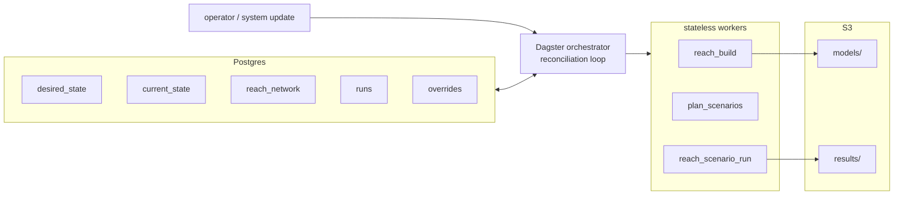
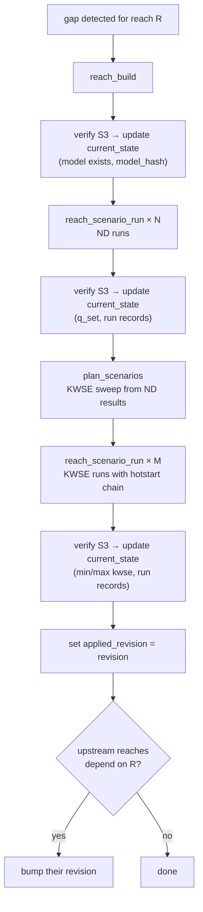
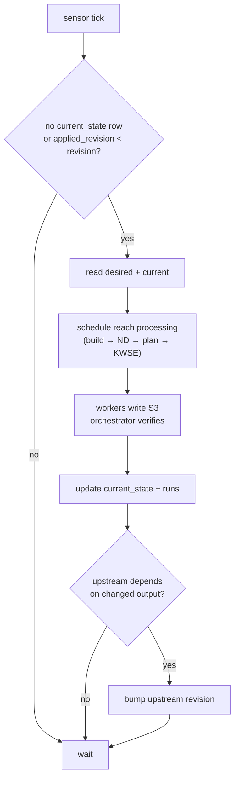
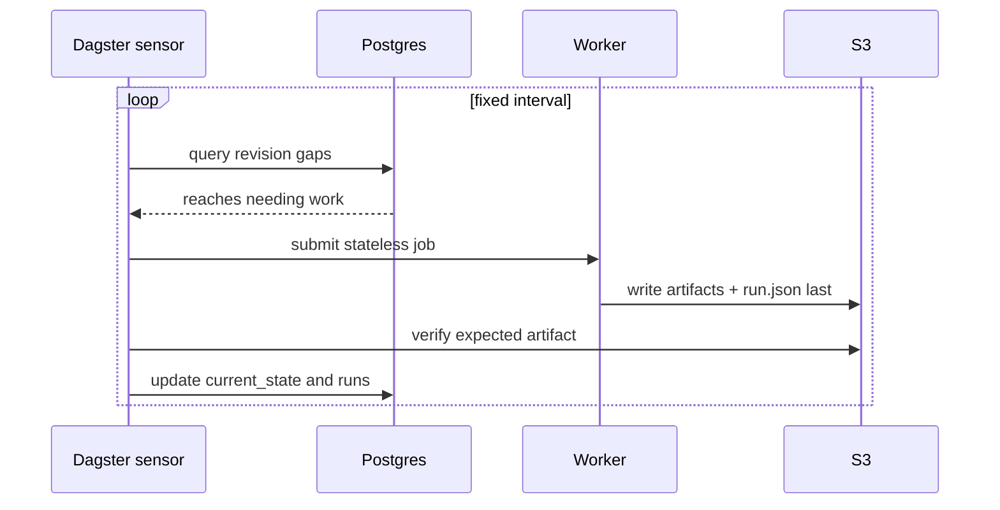
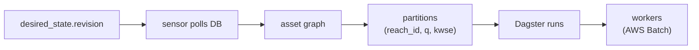

# Orchestrator Design

Detailed schemas, paths, and worker signatures in [`specs/pipeline-contracts.md`](specs/pipeline-contracts.md) and [`specs/triggers-and-propagation.md`](specs/triggers-and-propagation.md).

## System Shape

Postgres is the brain, Dagster is the controller, workers are stateless, S3 is the artifact plane.



| Rule | Detail |
|---|---|
| State advances only after S3 verification | Orchestrator gets completion signal, checks S3, then writes DB |
| Completion signal | `manifest.json` (model build) or `run.json` (scenario run) PUT LAST at expected S3 path |

### DB tables

| Table | Purpose |
|---|---|
| `desired_state` | What the system should produce per reach. `revision` increments on change. Nullable fields = use default. |
| `current_state` | What's been achieved. `applied_revision` tracks last applied. Gap = `applied_revision < revision`. |
| `runs` | Per-run ledger with BC provenance for propagation. |
| `reach_network` | Topology — reach_id, reach_to_id, terminal/headwater/lake flags. |
| `overrides` | User-authored patches. `override_id` (PK), `reach_id` (FK). `desired_state` references a single override. |
| `desired_state_log` | Append-only audit log — who changed what, when, and why. |
| `metadata` | TBD. |

Full DDL in [pipeline-contracts.md §2](specs/pipeline-contracts.md).

## S3 Paths — Identity vs Realization

Identity and realization are always separate in hashes and paths.

```
models/reach={id}/{model_identity_hash}+{domain_geohash}/
    manifest.json, dem.tif, roughness.tif, vectors...

results/reach={id}/{model_identity_hash}/{run_identity_hash}/z={z}/f={f}/
    depth.tif, stl.geojson, run.json
```

- **model_identity_hash** = reach + methodology + overrides (domain excluded)
- **domain_geohash** = spatial realization (bbox, resolution)
- **run_identity_hash** = engine + engine version
- **z** = elevation (KWSE), **f** = flow (Q) — consistent with ripple1d
- Results filed under model_identity only — runs survive domain changes

## Reach Processing (cold start)



## Reconciliation Loop

Each tick moves current state toward desired state. Content-addressed paths make the loop safe to retry.



## DB Listening

Polling is primary — simple, observable, guaranteed progress.



| Mechanism | Role |
|---|---|
| Polling | Primary. Finds `applied_revision < revision` gaps. |
| S3 verification | Required. Confirms artifact before DB advances. |
| Periodic S3 rescan | Safety net. Repairs DB/S3 drift. |
| LISTEN/NOTIFY | Optional. Wakes poller faster. |

## Dagster Fit



| Option | Fit | Why |
|---|---|---|
| **Dagster** | Strong | Asset materialization + partition state = desired vs current. Built-in sensors, run cancellation, backfills, UI. |
| Airflow | Weaker | DAG-run oriented. No native asset staleness or partition catalog. |
| Prefect | Weaker | Flexible flows but less opinionated on asset lineage and materialization tracking. |
| Custom | Possible | Closest pattern match but rebuilds scheduling, UI, retries, backfills from scratch. |
