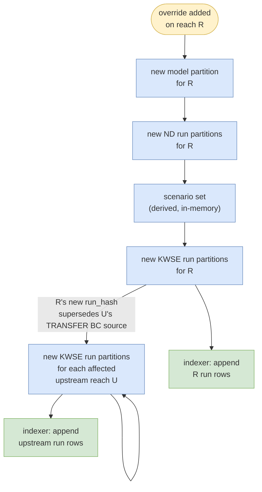

# Triggers, sensors, propagation

Strawmen for design review. This file specifies:

1. The catalog of triggers (trigger sources + indexer triggers).
2. Sensor specs (what each sensor watches, and when it fires).
3. Propagation — how new partitions cascade upstream through the reach network.
4. Run preemption policy — what happens to in-flight work when a newer partition supersedes it.
5. Trigger consolidation — how multiple triggers arriving close in time or during in-flight work are coalesced.

## What feedback I'm seeking

1. ~~**Topology propagation for `scenario_added`**~~ — *Confirmed yes (PR #73 #16): "this is one of the most important aspect for you in the pipeline. System should be tolerant that it handle multiple propagation within the network." §3 structurally rewritten 2026-05-14; algorithm details still TBD — see [TBD] banner below.*
2. **Catalog "current" semantics** — when multiple `(model_manifest_hash, run_hash)` rows exist for the same `(reach_id, q_label, kwse_label)`, how do consumers know which is current?
   **Proposal for review (PR #73 #17):** **latest-by-`indexed_at`**. Consumers `ORDER BY indexed_at DESC LIMIT 1` per `(reach_id, q_label, kwse_label)`. No boolean flag, no view — indexer only ever appends, never mutates old rows. Most consistent with "S3 is immutable, Postgres is the queryable derived view." Open: index design — `(reach_id, q_label, kwse_label, indexed_at DESC)`.
3. **Event delivery mechanism** — *Parked (PR #73 #18): "I will leave that to you. We can also discuss this with Kevin, and Dewberry."* Not blocking the mock.
4. ~~**Invalidation policy**~~ — *Confirmed kill in-flight (PR #73 #19).*

---

## [TBD] Open design questions

Structural rewrite landed 2026-05-14 (sections renamed; "stale/invalidation" vocabulary replaced with "propagation/superseded partition" per PR #73 #20; `scenario_added` row removed from §1.1 per PR #73 #25). The remaining open items below need design discussion with team.

**1. Propagation algorithm (PR #73 #16, #26).** Pipeline scope confirmed in 2026-05-14 meeting. **Proposed design (TBD):** two complementary discovery mechanisms — (a) **topology graph walk** identifies candidate upstream reaches with bounded fan-out; (b) **catalog lookup** on `boundary_conditions[].source.from_run_hash` confirms which candidates need re-running (vs. those already pointing at the new R hash or sampled from a different downstream version). Topology alone over-fires; catalog alone over-scans. Detailed sub-questions still open: coalescing strategy when many downstream changes land in burst, termination at network headwaters, cycle detection, idempotency guarantees, interaction with run preemption (§4) and trigger consolidation (§5).

**2. Trigger consolidation policy.** New design question raised in 2026-05-14 meeting. See §5 for the concrete cases the policy must cover. Pending design discussion.

**3. Catalog "current" semantics.** Proposed latest-by-`indexed_at` (see Q2 in feedback list above). Pending team confirmation.

---

## 1. Triggers

Triggers fall into two categories. **Trigger sources** describe what events cause new partitions to be materialized. **Indexer triggers** drive catalog updates as new artifacts land.

### 1.1 Trigger sources

| # | Event | Trigger source | New partition(s) materialized |
|---|---|---|---|
| 1 | `override_added` | New folder under `overrides/reach=<id>/` | New model partition for reach R; cascades to new ND / KWSE run partitions for R; propagates to new KWSE run partitions on affected upstream reaches (see §3) |
| 2 | `hydrofabric_updated` | New `HydrofabricRef.snapshot` value | New model partitions globally; cascades to ND / KWSE runs |
| 3 | `dem_snapshot_updated` | New `DemSource.snapshot_date` value | New model partitions globally; cascades to ND / KWSE runs |
| 4 | `aep_discharges_updated` | New NWM AEP discharge file | New KWSE run partitions where Q values change |
| 5 | `manual_rerun_request` | Operator API call / Dagster UI button | Whichever scope the operator requests — single run, single reach, or reach + upstream propagation |
| 6 | `topology_change` | Reach added/removed from network | New partitions for affected reach DAG nodes |

Mock implements #1 (`override_added`) for the propagation demo. The rest are sketched here for contract completeness.

### 1.2 Indexer triggers

**[TBD] PR #73 #24** — at production scale ("millions of rows and events") row-at-a-time upsert won't scale. Need a batching strategy: buffer events for N seconds OR M events, then bulk-insert. Failure-recovery story already covered by `scheduled_rescan` (#2 below).

| # | Event | Trigger source | Action |
|---|---|---|---|
| 1 | `run_manifest_landed` | New `run.manifest.json` appears in `results/.../q=*/kwse=*/` (PUT-last completion signal) | Read the manifest, upsert one catalog row |
| 2 | `scheduled_rescan` | Cron from Dagster scheduler | Crawl `results/` and upsert any rows missed due to dropped events (reconciliation) |

## 2. Sensor specs

### 2.1 `override_added_sensor`

**Watches:** `overrides/reach=*/` directories.\
**Fires when:** a new subdirectory appears containing both `patch.tif` and `manifest.yaml`.

### 2.2 `run_manifest_landed_sensor`

**Watches:** newly-created `run.manifest.json` files under `results/reach=*/.../q=*/kwse=*/`.\
**Fires when:** a new `run.manifest.json` appears.

## 3. Propagation

When a trigger from §1.1 fires on reach R, the pipeline materializes a chain of new partitions for R, and then propagates upstream through the reach network to any reach whose runs were sampling from R's prior outputs.

Old artifacts at the prior R / U paths are left untouched in S3 — they remain queryable for history but the catalog's "current" view (see Q2 above) now points at the new run rows.

### 3.1 Discovery mechanism (proposed — TBD)

When a new `run.manifest.json` lands for reach R, the propagator discovers dependent upstream reaches via two complementary mechanisms:

| Mechanism | What it does | Why we need it |
|---|---|---|
| **(a) Topology graph walk** | From R, look up the immediate upstream neighbors (U₁, U₂, ...) in the reach network. | Bounds the search — typically 1-3 neighbors per reach. |
| **(b) Catalog lookup on BC pointers** | For each candidate U, query: does U's current run for the relevant `(q_label, kwse_label)` reference R's prior `run_hash` in its TRANSFER BC `source.from_run_hash`? | Decides which candidates *actually* need re-running. Avoids re-running upstream U if its TRANSFER BC source was sampled from a different downstream version (still current). |

If a candidate's current run does reference R's now-superseded `run_hash`, the propagator derives U's new partition key (its TRANSFER BC source updates to R's new run) and triggers materialization. When U's new `run.manifest.json` lands, the same logic fires for U's upstream neighbors. Recursion terminates at network headwaters or when a candidate's current run already points at the new downstream version.

**Still TBD** — coalescing strategy under burst load, cycle detection (defensive), idempotency under retries, and interaction with run preemption (§4) and trigger consolidation (§5). See [TBD] banner at top.

## 4. Run preemption policy

When a sensor fires that triggers a new partition while a worker for the *prior* partition key is still running, the in-flight run is **superseded** and the pipeline **kills** it. Confirmed in PR #73 #19.

| Situation | Mock behavior | Real behavior |
|---|---|---|
| Sensor fires while a worker is executing for a now-superseded partition | Dagster cancels the run | Same; cancel signal propagated to engine container; container exits |
| Partial outputs (e.g. `depth.tif` written but not `run.manifest.json`) | Left on disk; the next run writes to a different content-addressed path | Same. Without `run.manifest.json`, the indexer never sees the partial state. |
| Sensor fires while a worker is queued for a now-superseded partition | Run never starts; replaced by a new run with current inputs | Same |

**PUT `run.json` LAST:** means partial outputs without their manifest don't reach the catalog, so consumers never see half-finished runs.

**Trade-off — orphan `depth.tif`:** kill-mid-write can leave a `depth.tif` on disk without a sibling `run.manifest.json` (the kill arrives between the `depth.tif` PUT and the manifest PUT). The orphan is invisible to consumers but consumes storage. Mitigated by a periodic scrub (delete `depth.tif` files lacking a sibling manifest) or atomic-rename writes (both files appear at the final path together).

## 5. Trigger consolidation

**[TBD]** New design question raised in the 2026-05-14 Dewberry call: *"How to consolidate multiple triggers."* When multiple triggers affect the same downstream work — either close in time, or while related work is already in flight — the pipeline needs a defined policy.

**Cases to cover:**

1. **Bursty inputs** — multiple overrides / downstream runs landing in a short window should coalesce into one work unit.
2. **In-flight ordering** — when a trigger for D arrives while upstream U is mid-run on D's prior outputs, do we kill U immediately or wait for D to re-run first?
3. **Manual + automatic colliding** — an operator rerun request and a system trigger fire for the same reach concurrently.

Pending design discussion.
