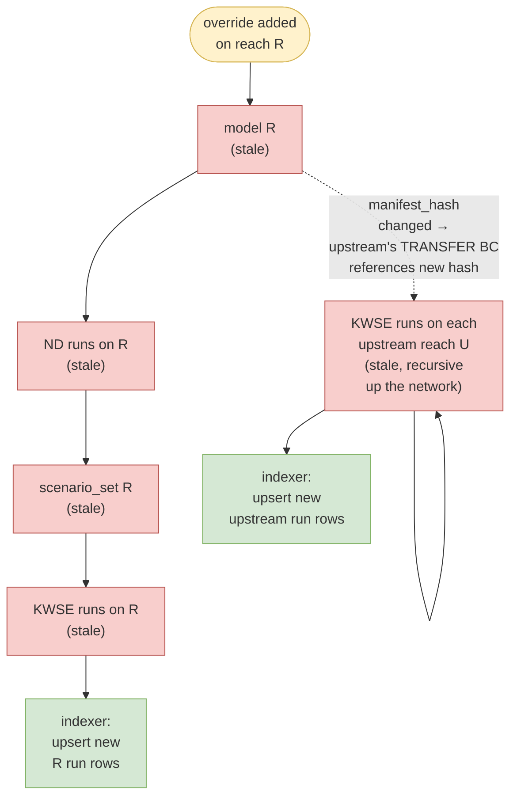

# Triggers, sensors, invalidation

Strawmen for design review. This file specifies:

1. The catalog of triggers (invalidation + indexer).
2. Sensor specs (what each sensor watches, and when it fires).

## What feedback I'm seeking

1. **Topology propagation for `scenario_added`** — should the cascade also propagate scenario changes upstream, given each upstream KWSE run's `TRANSFER` BC references a specific downstream `run_hash`?
2. **Catalog "current" semantics** — when multiple `(model_manifest_hash, run_hash)` rows exist for the same `(reach_id, q_label, kwse_label)`, how do consumers know which is current? A boolean flag on the row, a latest-by-`indexed_at` convention, or a derived view?
3. **Event delivery mechanism** — any opinion on SQS, EventBridge, direct S3 notifications, etc., for the prod pipeline?
4. **Invalidation policy** — when an invalidation trigger fires while a solve is already in flight, **kill** the run (currently proposing — cheaper compute, simpler catalog) or **let it finish and mark its outputs stale** (no wasted compute, but needs a `stale` flag and cleanup story)?

---

## 1. Triggers

Triggers fall into two categories. **Invalidation triggers** mark existing assets stale, driving Dagster rematerialization. **Indexer triggers** drive catalog updates without changing assets.

### 1.1 Invalidation triggers

| # | Event | Trigger source | Asset(s) marked stale |
|---|---|---|---|
| 1 | `override_added` | New folder under `overrides/reach=<id>/` | Model build for reach, ND runs, scenario set, KWSE runs, upstream reaches |
| 2 | `scenario_added` | New entry in the scenario-config input source (a config file, API, or DB row depending on deployment) | Scenario set, KWSE runs (matching new scenario partitions) |
| 3 | `hydrofabric_updated` | New `HydrofabricRef.snapshot` value | All models (global) |
| 4 | `dem_snapshot_updated` | New `DemSource.snapshot_date` value | All models (global) |
| 5 | `aep_discharges_updated` | New NWM AEP discharge file | Scenario sets (Q values change), KWSE runs |
| 6 | `manual_rerun_request` | Operator API call / Dagster UI button | Whichever scope the operator requests — single run, single reach, or reach + upstream cascade |
| 7 | `topology_change` | Reach added/removed from network | All affected reach DAG nodes |

Mock implements #1 and #2. The rest are sketched here for contract completeness.

### 1.2 Indexer triggers

| # | Event | Trigger source | Action |
|---|---|---|---|
| 1 | `run_manifest_landed` | New `run.manifest.json` appears in `results/.../q=*/kwse=*/` (PUT-last completion signal) | Read the manifest, upsert one catalog row |
| 2 | `scheduled_rescan` | Cron from Dagster scheduler | Crawl `results/` and upsert any rows missed due to dropped events (reconciliation) |

## 2. Sensor specs

### 2.1 `override_added_sensor`

**Watches:** `overrides/reach=*/` directories.\
**Fires when:** a new subdirectory appears containing both `patch.tif` and `manifest.yaml`.

### 2.2 `scenario_added_sensor`

**Watches:** the scenario-config input source (polled for changes).\
**Fires when:** the source is updated AND a new scenario entry exists relative to the last observed state.

### 2.3 `run_manifest_landed_sensor`

**Watches:** newly-created `run.manifest.json` files under `results/reach=*/.../q=*/kwse=*/`.\
**Fires when:** a new `run.manifest.json` appears.

## 3. Invalidation cascade

Propagation graph for an `override_added` event on reach **R**:

For `scenario_added`, the cascade is **bounded**: only the new `(reach, q, kwse)` KWSE-run partitions become stale — no model rebuild, no upstream propagation by default. Whether to also propagate upstream is open — see question 1 at the top of this doc.

## 4. Invalidation policy

On a stale-while-running, **kill** the in-flight upstream solve.

| Situation | Mock behavior | Real behavior |
|---|---|---|
| Sensor fires while a worker is executing | Dagster cancels the run | Same; cancel signal propagated to engine container; container exits |
| Partial outputs (e.g. `depth.tif` written but not `run.manifest.json`) | Left on disk; next run overwrites at a different content-addressed path | Same. Without `run.manifest.json`, indexer never sees the partial state. |
| Sensor fires while a worker is queued | Run never starts; replaced by a new run with current inputs | Same |

**PUT `run.json` LAST:** means partial outputs without their manifest don't reach the catalog, so consumers never see half-finished runs.

**Trade-off — orphan `depth.tif`:** kill-mid-write can leave a `depth.tif` on disk without a sibling `run.manifest.json` (the kill arrives between the `depth.tif` PUT and the manifest PUT). The orphan is invisible to consumers but consumes storage. Mitigated by a periodic scrub (delete `depth.tif` files lacking a sibling manifest) or atomic-rename writes (both files appear at the final path together).
