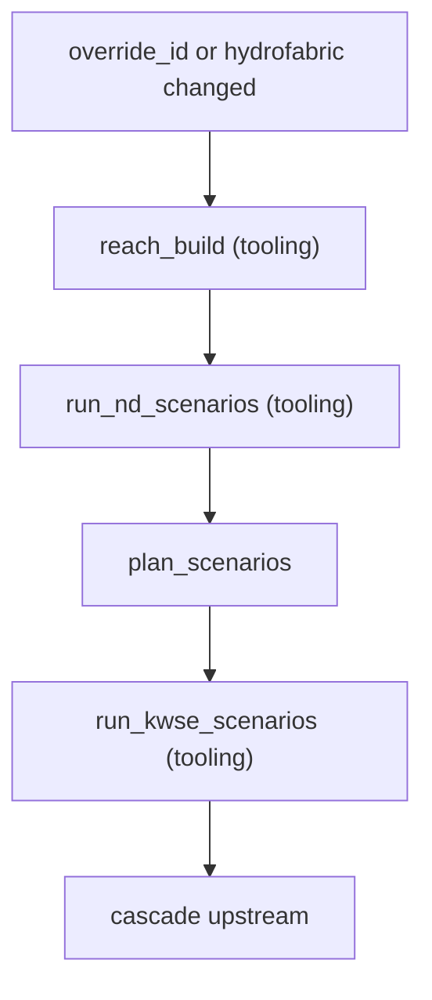
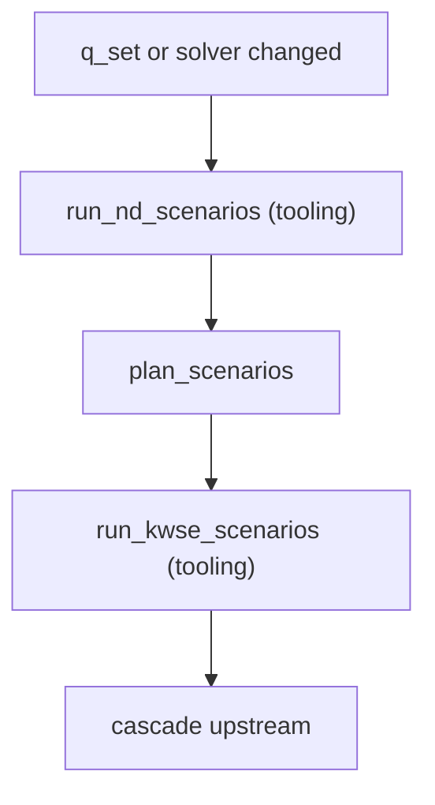
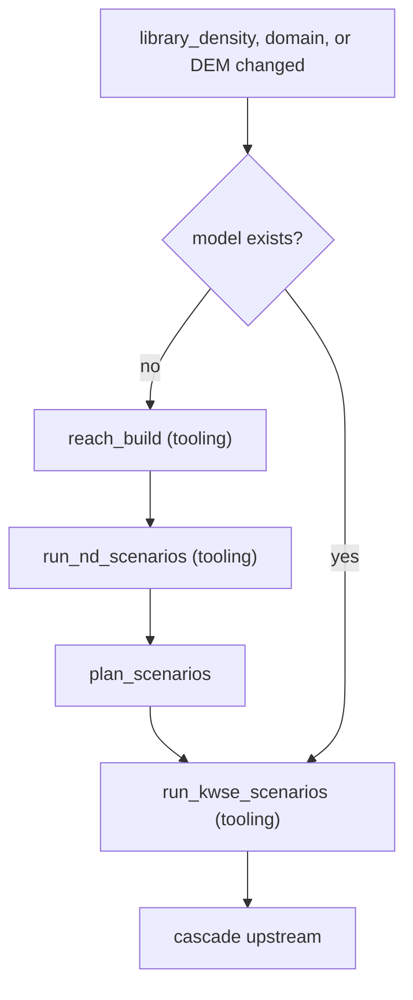
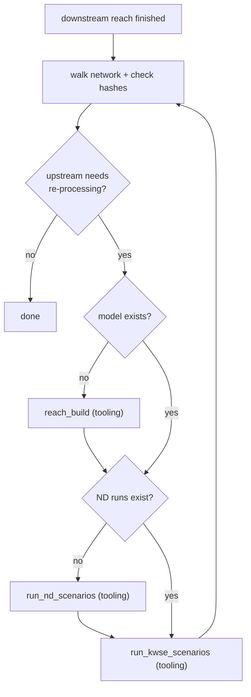
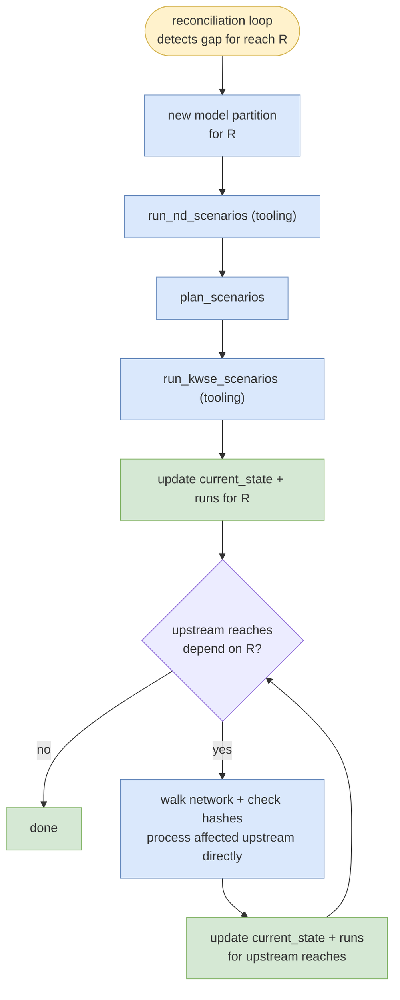

# Triggers, reconciliation, propagation

Strawmen for design review. This file specifies:

1. Trigger sources (changes to `desired_state`).
2. Reconciliation loop — how the orchestrator detects gaps and schedules work.
3. Propagation — how new partitions cascade upstream through the reach network.
4. Run preemption policy — what happens to in-flight work when a newer revision supersedes it.
5. Trigger consolidation — how multiple triggers arriving close in time or during in-flight work are coalesced.

---

## Open design questions

**Propagation algorithm.** Two complementary discovery mechanisms — (a) topology graph walk via `reach_network` table bounds candidate upstream reaches; (b) BC provenance lookup via `runs.transfer_bc_from_run_hash` confirms which candidates actually need re-running. See §3.1.

**Trigger consolidation.** Simplified by the reconciliation loop — multiple changes between ticks coalesce into one gap computation. See §5.

---

## 1. Triggers

`desired_state.revision` only changes from external events. The reconciliation loop (§2) detects the gap and schedules work.

### 1.1 External triggers

| ID | Trigger | Mechanism | Rebuild Model | Invalidate Model | New ND Runs | New KWSE Runs | Propagate Upstream |
|---|---|---|---|---|---|---|---|
| 1 | override added | Row inserted in `overrides` table. Inert until revision is bumped. | — | — | — | — | — |
| 2 | revision_bumped → override_id updated | External update to `desired_state.override_id` + revision bump | Yes | Yes | (cascade) | (cascade) | (cascade) |
| 3 | revision_bumped → q_set updated | External update to `desired_state.q_set` + revision bump | No | No | Yes | (cascade) | (cascade) |
| 4 | revision_bumped → solver updated | External update to `desired_state.solver` + revision bump | No | No | Yes | (cascade) | (cascade) |
| 5 | revision_bumped → library_density updated | External update to library_density fields + revision bump | No | No | No | Yes | (cascade) |
| 6 | revision_bumped → domain updated | External update to `desired_state.model_domain` + revision bump | Yes | No | Yes (if don't exist) | Yes | (cascade) |
| 7 | hydrofabric_updated | System-wide; revision bumped for all affected reaches | Yes | Yes | (cascade) | (cascade) | (cascade) |
| 8 | dem_snapshot_updated | System-wide; revision bumped for all affected reaches | Yes | No | Yes (if don't exist) | Yes | (cascade) |

### 1.2 Internal triggers (cascade)

Not revision bumps. Follow-on work after a reach finishes processing (see §3).

| ID | Trigger | Mechanism | Rebuild Model | New ND Runs | New KWSE Runs |
|---|---|---|---|---|---|
| 9 | reach finished → process upstream | Walk network + check hashes. For each affected upstream reach: | If doesn't exist | If don't exist | Yes (updated TRANSFER BC and/or KWSE range) |
| 10 | reach finished → STLs updated | STL output informs upstream model_domain. | — | — | — |

### 1.3 Trigger flows

**A. Model rebuild (rows 2, 7)** — full chain from build.

**B. New ND runs (rows 3, 4)** — model unchanged, re-run from ND.

**C. New KWSE / domain (rows 5, 6, 8)** — build first if model doesn't exist (domain change = new path).

**D. Upstream cascade (row 9)** — after downstream completes, process each affected upstream reach.

### 1.4 Note on indexer

In the DB-as-brain architecture, the orchestrator replaces the indexer as the sole DB writer, updating `current_state` and `runs` directly after job completion. The `scheduled_rescan` concept survives as a periodic S3 reconciliation safety net.

## 2. Reconciliation loop

The reconciliation loop is the core scheduling mechanism, borrowed from the Kubernetes controller pattern (guide.md): the orchestrator watches for differences between `desired_state` and `current_state`, acts to close the gap, writes what it observed back into `current_state`, then watches again.

### 2.1 Loop mechanism

Each tick of the reconciliation loop:

1. **Query gap** — find all reaches where `current_state.applied_revision < desired_state.revision` (or where no `current_state` row exists).
2. **Compute work** — for each gap reach, compare `desired_state` fields against `current_state` to determine what needs building (new model, new ND runs, new KWSE runs). Content-addressed paths mean existing valid artifacts are skipped.
3. **Schedule work** — submit tooling jobs (`reach_build`, `run_nd_scenarios`, `run_kwse_scenarios`) and pipeline function (`plan_scenarios`). Workers are stateless (see pipeline-contracts spec §4).
4. **Update state** — when a job completes, the orchestrator verifies S3 artifacts, then updates `current_state` and appends to `runs`. When all work for a reach is complete, set `current_state.applied_revision = desired_state.revision`.
5. **Cascade upstream** — walk network + check hashes; process affected upstream reaches directly (see §3). Upstream `desired_state.revision` is not bumped.
6. **Repeat** — return to step 1.

**Current state formation:** job completion signal → verify S3 artifact exists → update DB. Periodic S3 rescan (§1.2) as safety net for crash recovery.

### 2.2 Detection mechanism

How does the orchestrator know when to run a tick?

| Approach | How it works | Trade-offs |
|---|---|---|
| **Polling (recommended)** | Orchestrator queries `WHERE applied_revision < revision` on a fixed interval (e.g., every 30s) | Simple, debuggable, guaranteed progress. Latency = up to one tick interval. No infrastructure dependency beyond the DB. |
| **LISTEN/NOTIFY (optimization)** | PSQL trigger on `desired_state` INSERT/UPDATE fires `NOTIFY revision_changed`; orchestrator `LISTEN`s and wakes immediately | Lower latency for single-change events. Adds complexity: must handle missed notifications, connection drops, reconnection. Layer on top of polling, never replace it. |

**Recommendation:** start with polling. Add LISTEN/NOTIFY as a latency optimization if tick interval becomes a bottleneck. Polling alone is sufficient for the mock and early production.

## 3. Propagation

When `desired_state.revision` is bumped for reach R, the reconciliation loop processes R. After R completes, the orchestrator cascades upstream — processing any reach whose runs depended on R's prior outputs. Upstream reaches are processed directly as part of R's trigger scope; their `desired_state.revision` is not bumped.

Superseded artifacts remain in S3 and age out via lifecycle policies. If the orchestrator crashes mid-cascade, periodic S3 rescan detects completed artifacts and syncs `current_state`.

### 3.1 Discovery mechanism

When reach R completes, the orchestrator discovers dependent upstream reaches via two mechanisms:

| Mechanism | What it does | Why we need it |
|---|---|---|
| **(a) Topology graph walk** | From R, look up immediate upstream neighbors (U₁, U₂, ...) in `reach_network`. | Bounds the search — typically 1-3 neighbors per reach. |
| **(b) BC provenance lookup** | For each candidate U, check `runs.transfer_bc_from_run_hash`: does U reference R's prior output? | Avoids re-running U if its BC source was sampled from a different downstream version (still current). |

If U references R's now-superseded output, the orchestrator processes U directly (same scope as R's trigger). When U completes, the same logic fires for U's upstream neighbors. Recursion terminates at headwaters or when a candidate's run already points at the new downstream output.

## 4. Run preemption policy

When `desired_state.revision` bumps while a worker for the prior revision is still running, the in-flight run is **superseded** and the orchestrator **kills** it. Policy confirmed: kill in-flight.

| Situation | Mock behavior | Real behavior |
|---|---|---|
| Revision bumps while a worker is executing for a now-superseded revision | Dagster cancels the run | Same; cancel signal propagated to engine container; container exits |
| Partial outputs (e.g. `depth.tif` written but not `run.json`) | Left on disk; the next run writes to a different content-addressed path | Same. Without `run.json`, the orchestrator never records the partial state.  |
| Revision bumps while a worker is queued for a now-superseded revision | Run never starts; replaced by a new run with current inputs | Same |

**PUT `run.json` LAST (§2.1):** partial outputs without their manifest never reach the orchestrator's state.

**Trade-off — orphan `depth.tif`:** kill-mid-write can leave a `depth.tif` on disk without a sibling `run.json` (the kill arrives between the `depth.tif` PUT and the manifest PUT). The orphan is invisible to consumers but consumes storage. Mitigated by a periodic scrub (delete `depth.tif` files lacking a sibling manifest) or atomic-rename writes (all files appear at the final path together).

## 5. Trigger consolidation

The reconciliation loop naturally coalesces multiple triggers — no explicit consolidation logic is needed.

**Cases and how they resolve:**

1. **Bursty inputs** — multiple overrides, downstream runs, or config changes landing in a short window each bump `desired_state.revision`. The reconciliation loop sees the resulting state at the next tick and computes one gap against the latest revision. Multiple changes between ticks = one work unit.

2. **Revision during processing** — kill in-flight, re-read latest `desired_state`, compute new gap. Content-addressed paths make completed work from the killed run reusable. See §4.

3. **Manual + automatic colliding** — an operator rerun request and a system trigger fire for the same reach concurrently. Both bump `desired_state.revision`; the loop sees the final resulting state and computes one gap.
