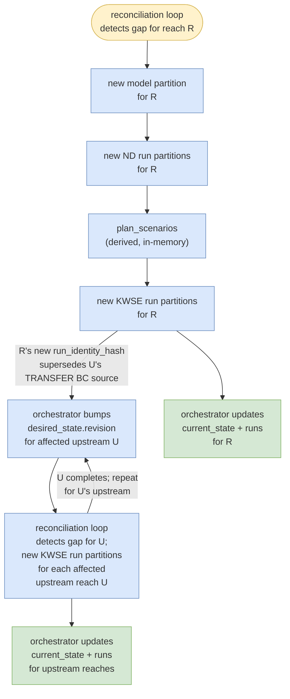

# Triggers, reconciliation, propagation

Strawmen for design review. This file specifies:

1. Trigger sources (changes to `desired_state`).
2. Reconciliation loop — how the orchestrator detects gaps and schedules work.
3. Propagation — how new partitions cascade upstream through the reach network.
4. Run preemption policy — what happens to in-flight work when a newer revision supersedes it.
5. Trigger consolidation — how multiple triggers arriving close in time or during in-flight work are coalesced.

## What feedback I'm seeking

1. ~~**Topology propagation for `scenario_added`**~~ — *Confirmed yes (PR #73 #16): "this is one of the most important aspect for you in the pipeline. System should be tolerant that it handle multiple propagation within the network." §3 structurally rewritten 2026-05-14; algorithm details still TBD — see [TBD] banner below.*
2. ~~**Catalog "current" semantics**~~ — *Resolved by `desired_state.revision` / `current_state.applied_revision`. The reconciliation loop compares `applied_revision < revision` to detect gaps — no "latest-by-indexed_at" query needed.*
3. ~~**Event delivery mechanism**~~ — *Resolved. The reconciliation loop (§2, polling + optional LISTEN/NOTIFY) is the delivery mechanism. No separate event channel needed.*
4. ~~**Invalidation policy**~~ — *Confirmed kill in-flight (PR #73 #19).*
5. **Reconciliation loop detection** — does PSQL trigger the orchestrator, or does the orchestrator watch PSQL? (guide.md open question: "Does PSQL trigger orchestrator or orchestrator watches PSQL"). Spec recommends **polling** (orchestrator queries the DB on a tick interval) as the primary mechanism; **LISTEN/NOTIFY** as a latency optimization layered on top. Polling is simpler, debuggable, and guarantees progress even if a notification is lost. See §2.2.
6. **Revision-during-processing kill policy** — if `desired_state.revision` bumps while work is in-flight for a reach: kill in-flight run, re-read `desired_state` at latest revision, compute new gap. Content-addressed paths mean completed work from the killed run is reusable if its inputs haven't changed. Confirm this policy. See §4.
7. **Current state formation** — does the orchestrator verify S3 artifacts to form `current_state`, or trust job completion signals? Guide says "controller watches S3 and forms the current state." Spec proposes: trust completion signals (worker writes `run.json` last = completion event), use periodic S3 reconciliation scan as a safety net. See §2.1.

---

## [TBD] Open design questions

Structural rewrite landed 2026-05-14 (sections renamed; "stale/invalidation" vocabulary replaced with "propagation/superseded partition" per PR #73 #20; `scenario_added` row removed from §1.1 per PR #73 #25). Architecture updated to DB-as-brain + reconciliation loop per guide.md (PR #72). The remaining open items below need design discussion with team.

**1. Propagation algorithm (PR #73 #16, #26).** Pipeline scope confirmed in 2026-05-14 meeting. **Proposed design (TBD):** two complementary discovery mechanisms — (a) **topology graph walk** via `reach_network` table identifies candidate upstream reaches with bounded fan-out; (b) **hash comparison** via `runs.transfer_bc_from_run_hash` confirms which candidates need re-running (vs. those already pointing at the new R hash or sampled from a different downstream version). Topology alone over-fires; hash comparison alone over-scans.

**2. Trigger consolidation policy.** Simplified by the reconciliation loop — multiple changes between ticks coalesce into one gap computation. See §5 (cases) and §2.2 (loop frequency tuning).

---

## 1. Triggers

Triggers cause `desired_state` changes and revision bumps. The reconciliation loop (§2) detects the resulting gap and schedules work.

### 1.1 Trigger sources

| # | Event | Mechanism | New partition(s) materialized |
|---|---|---|---|
| 1 | `override_added` | New override record inserted into `overrides` table; orchestrator updates `desired_state.override_id` and bumps `revision` for affected reach | New model partition for reach R; cascades to new ND / KWSE run partitions for R; propagates to new KWSE run partitions on affected upstream reaches (see §3) |
| 2 | `hydrofabric_updated` | System-wide config change; orchestrator bumps `revision` for all affected reaches. Note: `desired_state` currently has no column for hydrofabric version — this is a system-wide parameter, not per-reach. | New model partitions globally; cascades to ND / KWSE runs |
| 3 | `dem_snapshot_updated` | System-wide config change; orchestrator bumps `revision` for all affected reaches. Same note as #2 — DEM version is system-wide. | New model partitions globally; cascades to ND / KWSE runs |
| 4 | `aep_discharges_updated` | New NWM AEP discharge file; orchestrator updates `desired_state.q_set` and bumps `revision` where Q values change | New KWSE run partitions where Q values change |
| 5 | `manual_rerun_request` | Operator API call / Dagster UI button; orchestrator bumps `revision` for requested scope | Whichever scope the operator requests — single run, single reach, or reach + upstream propagation |
| 6 | `topology_change` | Reach added/removed from `reach_network` table; orchestrator inserts/updates `desired_state` rows and bumps `revision` for affected reaches | New partitions for affected reach DAG nodes |

Mock implements #1 (`override_added`) for the propagation demo. The rest are sketched here for contract completeness.

### 1.2 Note on indexer

In the DB-as-brain architecture, the orchestrator replaces the indexer as the sole DB writer, updating `current_state` and `runs` directly after job completion. The `scheduled_rescan` concept survives as a periodic S3 reconciliation safety net (see Q7).

## 2. Reconciliation loop

The reconciliation loop is the core scheduling mechanism, borrowed from the Kubernetes controller pattern (guide.md): the orchestrator watches for differences between `desired_state` and `current_state`, acts to close the gap, writes what it observed back into `current_state`, then watches again.

### 2.1 Loop mechanism

Each tick of the reconciliation loop:

1. **Query gap** — find all reaches where `current_state.applied_revision < desired_state.revision` (or where no `current_state` row exists).
2. **Compute work** — for each gap reach, compare `desired_state` fields against `current_state` to determine what needs building (new model, new ND runs, new KWSE runs). Content-addressed paths mean existing valid artifacts are skipped.
3. **Schedule work** — submit jobs to workers (`reach_build`, `plan_scenarios`, `reach_scenario_run`). Workers are stateless (see pipeline-contracts spec §4).
4. **Update state** — when a job completes, the orchestrator updates `current_state` and appends to `runs`. When all work for a reach is complete, set `current_state.applied_revision = desired_state.revision`.
5. **Repeat** — return to step 1.

**Current state formation (see Q7):** trust job completion signals (worker writes `run.json` last as the completion event) as the primary mechanism. Periodic S3 reconciliation scan (§1.2) as safety net.

### 2.2 Detection mechanism

How does the orchestrator know when to run a tick? Two approaches (see Q5):

| Approach | How it works | Trade-offs |
|---|---|---|
| **Polling (recommended)** | Orchestrator queries `WHERE applied_revision < revision` on a fixed interval (e.g., every 30s) | Simple, debuggable, guaranteed progress. Latency = up to one tick interval. No infrastructure dependency beyond the DB. |
| **LISTEN/NOTIFY (optimization)** | PSQL trigger on `desired_state` INSERT/UPDATE fires `NOTIFY revision_changed`; orchestrator `LISTEN`s and wakes immediately | Lower latency for single-change events. Adds complexity: must handle missed notifications, connection drops, reconnection. Layer on top of polling, never replace it. |

**Recommendation:** start with polling. Add LISTEN/NOTIFY as a latency optimization if tick interval becomes a bottleneck. Polling alone is sufficient for the mock and early production.

## 3. Propagation

When a trigger updates `desired_state` for reach R, the reconciliation loop materializes new partitions for R, then propagates upstream to any reach whose runs sampled from R's prior outputs.

Old artifacts at the prior R / U paths are left untouched in S3 — they remain accessible for history but `current_state` now reflects the new hashes. Superseded artifacts age out via S3 lifecycle policies.

### 3.1 Discovery mechanism (proposed — TBD)

When reach R completes its runs, the propagator discovers dependent upstream reaches via two complementary mechanisms:

| Mechanism | What it does | Why we need it |
|---|---|---|
| **(a) Topology graph walk** | From R, look up the immediate upstream neighbors (U₁, U₂, ...) in the `reach_network` table. | Bounds the search — typically 1-3 neighbors per reach. |
| **(b) Hash comparison on BC pointers** | For each candidate U, query `runs` table: does U's current run reference R's prior `run_hash` in its `transfer_bc_from_run_hash` column? | Decides which candidates *actually* need re-running. Avoids re-running upstream U if its TRANSFER BC source was sampled from a different downstream version (still current). |

If a candidate's current run does reference R's now-superseded `run_hash`, the orchestrator bumps `desired_state.revision` for U. The reconciliation loop picks up U's gap on the next tick and schedules materialization. When U completes, the same logic fires for U's upstream neighbors. Recursion terminates at network headwaters or when a candidate's current run already points at the new downstream version.

## 4. Run preemption policy

When `desired_state.revision` bumps while a worker for the prior revision is still running, the in-flight run is **superseded** and the orchestrator **kills** it. Confirmed in PR #73 #19. See Q6 for the full revision-during-processing policy.

| Situation | Mock behavior | Real behavior |
|---|---|---|
| Revision bumps while a worker is executing for a now-superseded revision | Dagster cancels the run | Same; cancel signal propagated to engine container; container exits |
| Partial outputs (e.g. `depth.tif` written but not `run.json`) | Left on disk; the next run writes to a different content-addressed path | Same. Without `run.json`, the orchestrator never records the partial state. (See pipeline-contracts spec Q11 for `run.json` naming.) |
| Revision bumps while a worker is queued for a now-superseded revision | Run never starts; replaced by a new run with current inputs | Same |

**PUT `run.json` LAST (§2.1):** partial outputs without their manifest never reach the orchestrator's state.

**Trade-off — orphan `depth.tif`:** kill-mid-write can leave a `depth.tif` on disk without a sibling `run.json` (the kill arrives between the `depth.tif` PUT and the manifest PUT). The orphan is invisible to consumers but consumes storage. Mitigated by a periodic scrub (delete `depth.tif` files lacking a sibling manifest) or atomic-rename writes (all files appear at the final path together).

## 5. Trigger consolidation

The reconciliation loop naturally coalesces multiple triggers — no explicit consolidation logic is needed.

**Cases and how they resolve:**

1. **Bursty inputs** — multiple overrides, downstream runs, or config changes landing in a short window each bump `desired_state.revision`. The reconciliation loop sees the resulting state at the next tick and computes one gap against the latest revision. Multiple changes between ticks = one work unit.

2. **Revision during processing** — kill in-flight, re-read latest `desired_state`, compute new gap. Content-addressed paths make completed work from the killed run reusable. See §4 and Q6.

3. **Manual + automatic colliding** — an operator rerun request and a system trigger fire for the same reach concurrently. Both bump `desired_state.revision`; the loop sees the final resulting state and computes one gap.

**Remaining open question:** loop frequency tuning. Too fast = wasted DB queries. Too slow = unnecessary latency. LISTEN/NOTIFY (§2.2) reduces this trade-off but adds complexity. Not blocking the mock — mock uses a configurable tick interval.
