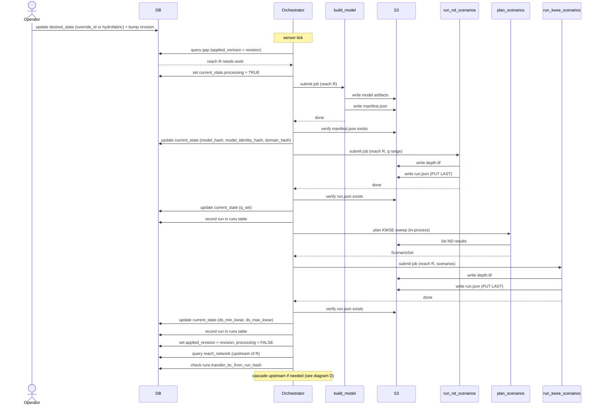
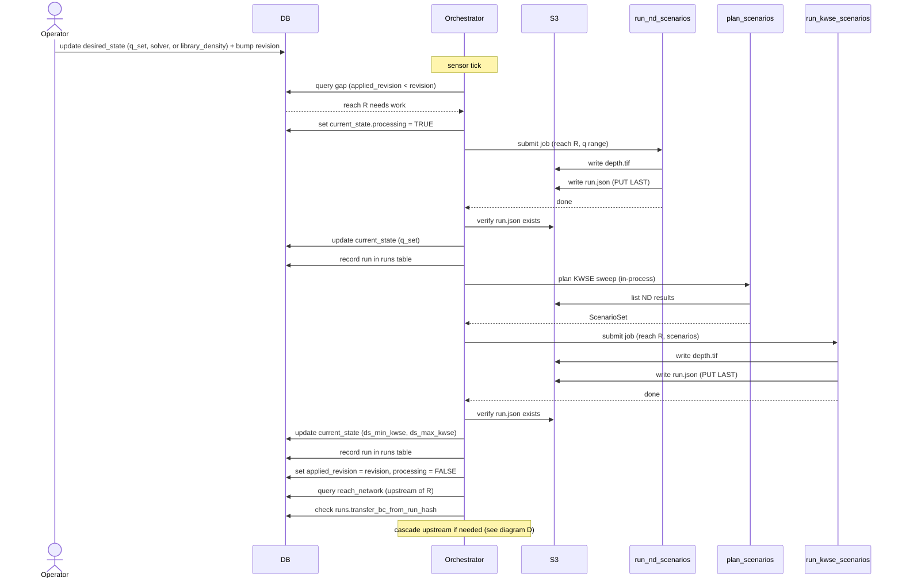
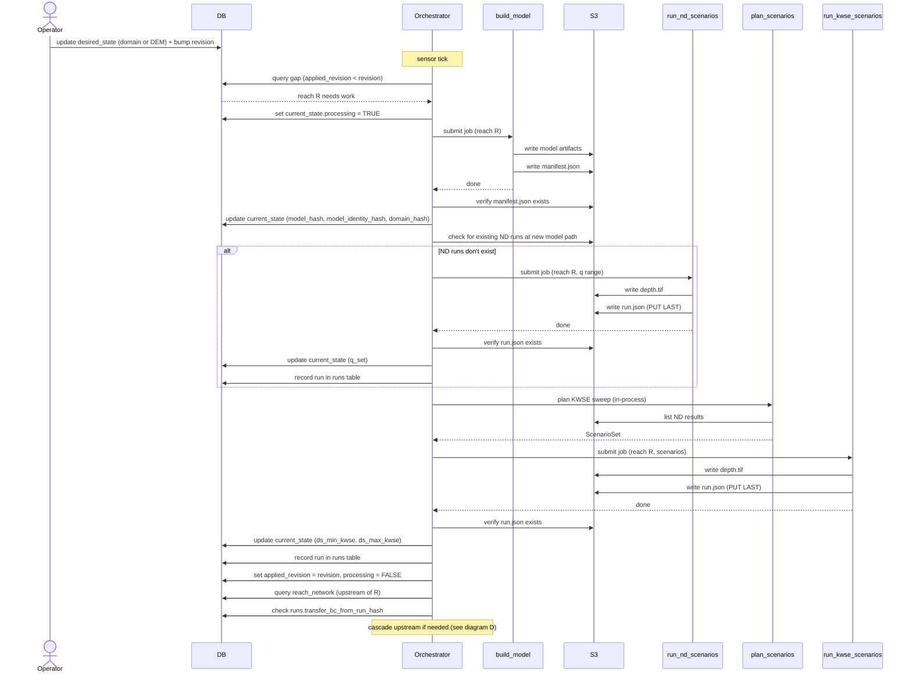
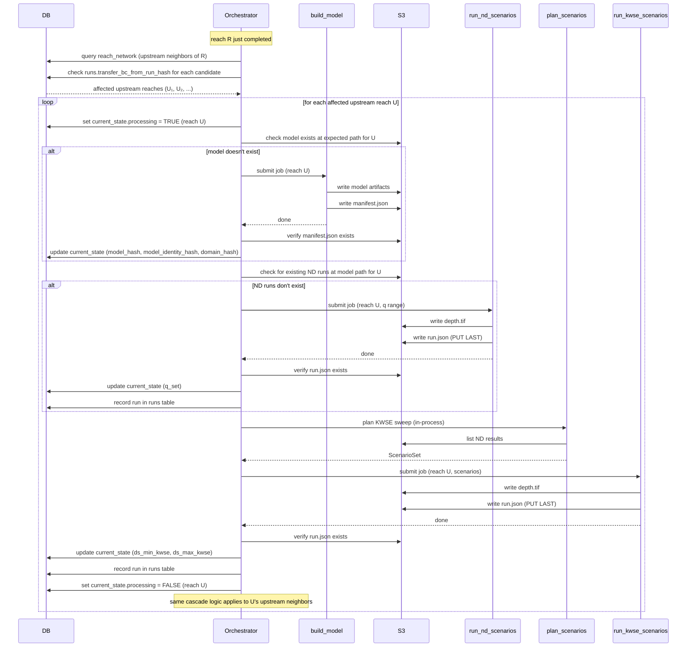

# Trigger sequence diagrams

Sequence diagram versions of the trigger flowcharts in [`triggers-and-propagation.md`](triggers-and-propagation.md) §1.3. These show which components are touched and in what order.

## A. Full chain (rows 2, 7)

Model invalidated — rebuild everything.

## B. New ND runs (rows 3, 4, 5)

Model unchanged — re-run from ND.

## C. Domain / DEM change (rows 6, 8)

Always rebuild model (new domain = new path). Skip ND if they already exist at the new model path.

## D. Upstream cascade (row 9)

After downstream reach R completes, process each affected upstream reach. Upstream `desired_state.revision` is NOT bumped.

